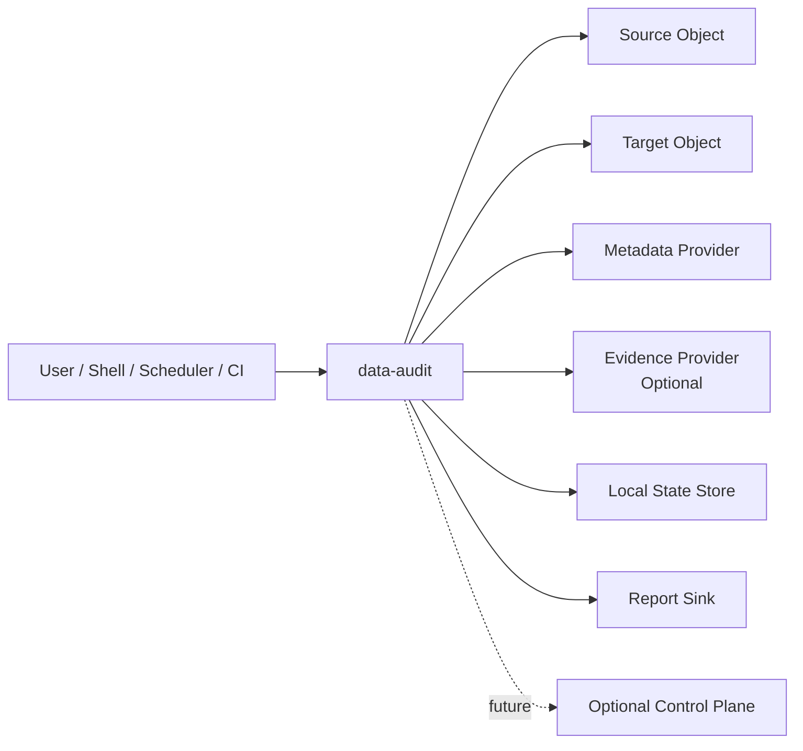
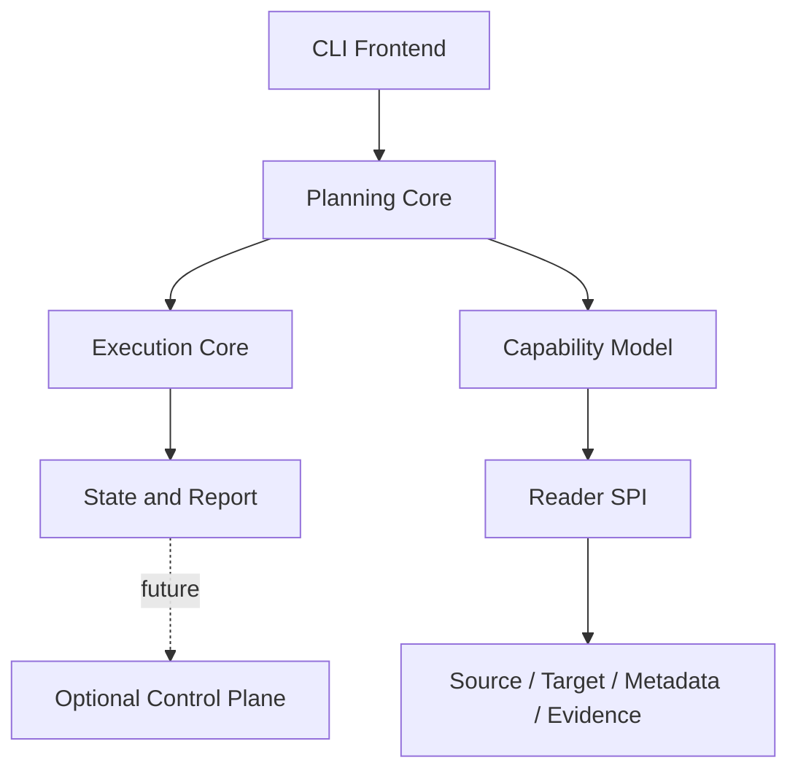
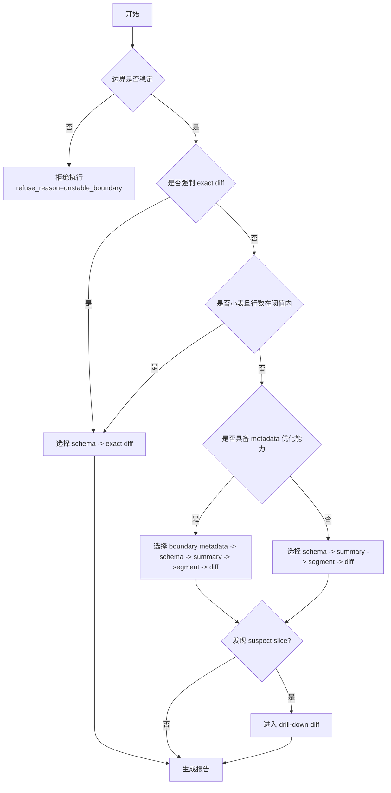
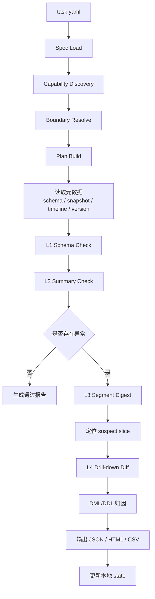
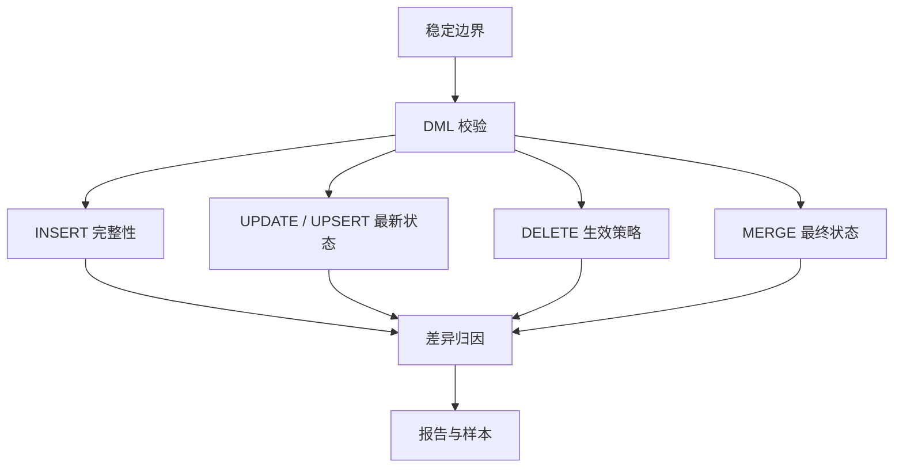
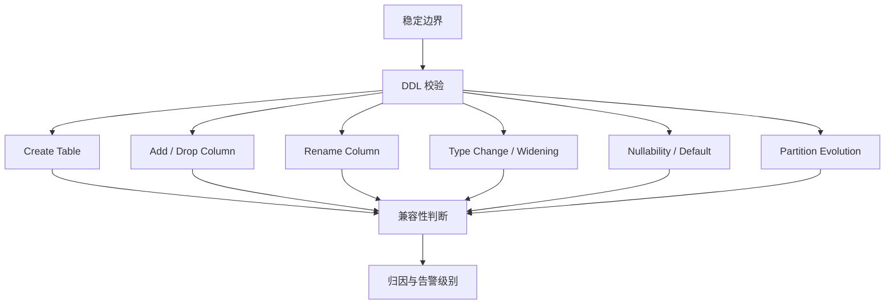

# data-audit 设计文档

> 暂定名。本文是 `data-audit` 的整体架构设计稿，目标是把“任务后一致性审计 CLI”的产品边界、运行时架构、默认路径和扩展模型定义清楚。

## 1. 背景

现有公开工具里，`dataCompare` 更偏数据库迁移/复制后的表对表比较：基于哈希并行比对，依赖 PostgreSQL repository，并带前端/UI 和一组数据库类型限制。这个方向适合数据库复制核验，但不等于大数据与湖仓场景下的任务后一致性审计。

在大数据 / 湖仓场景里，常见对象具备更复杂的边界和演进特征：

- Iceberg 支持 schema evolution 与 partition evolution，旧布局与新布局可以共存
- Hudi 的 timeline / completion time 决定一个提交边界何时可见
- Paimon 每次 commit 都会生成 snapshot，且 append table 可以没有主键
- Delta CDF 不是默认开启，并且在 column mapping 与非加性 schema change 下存在读取限制

因此，普通的“全表 hash compare”在这些场景里要么太贵，要么容易误报。

## 2. 产品定位与边界

`data-audit` 不是字段规则校验器，也不是同步平台插件，而是：

> 一个统一的任务后一致性审计 CLI，用于在大数据、湖仓、数据库、文件集等异构对象之间，对某个稳定边界上的结果状态进行分层校验，并输出可定位、可复查的差异证据。

它主要回答四类问题：

- 任务跑完了，结果到底对不对
- 问题出在哪个分区 / 哪个 snapshot / 哪个时间窗口
- 是漏数、重复、删除没生效，还是 schema 演进导致的误报
- 下次复查时，能不能只查这次受影响的范围

MVP 产品边界固定为：

- 单进程
- 单命令
- 单次任务运行
- 默认 CLI-only

未来可以扩展可选控制面，但只作为报告汇聚和策略编排层，不改变 CLI-first 边界。

### 非目标

- 不参与 SeaTunnel / DataX / Flink CDC 的任务编排或执行
- 不做同步链路中的 inline 校验
- 不做当前版本的平台、Web 管理端、租户系统、任务中心
- 不承诺替代数据质量平台；它偏“一致性审计”，不是通用 rule engine

## 3. 核心设计原则

1. 不做同步中校验，只做边界后的结果审计。
2. 校验对象是“已提交边界上的结果状态”，不是“流内中间事件过程”。
3. 默认由 planner 自动选择最小必要、可解释的审计路径。
4. `exact diff` 始终是最终裁决；`hash / digest / checksum` 只负责提速和缩小范围。
5. 先利用元数据、摘要和切片逐层缩小范围，再做精确 diff。
6. 对 DDL / schema evolution / partition evolution 做显式建模，不把所有变化都判成错误。
7. evidence 模式是可选增强，不是默认依赖。
8. 对无主键、大表、分区表场景保持可运行。
9. `data-audit` 默认是只读审计器，不写 source/target 业务数据。

## 4. 系统上下文

### 4.1 系统上下文图



系统边界说明：

- `source / target` 是被审计对象，不是同步链路的一部分
- `metadata provider` 可以是 catalog、manifest、timeline、version log 等边界信息来源
- `evidence provider` 是可选旁证来源，例如 CDC / CDF / audit log 导出
- `state store` 和 `report sink` 默认本地化
- `optional control plane` 只保留未来扩展位，不属于 MVP

### 4.2 与 dataCompare 的差异化

| 维度 | dataCompare | data-audit |
| --- | --- | --- |
| 产品形态 | 服务 + repository + UI | 单 CLI |
| 默认部署 | 依赖 PostgreSQL repository，README 列出前端依赖 | 本地状态即可运行，默认 SQLite / JSON |
| 默认对象 | 迁移/复制后的数据库表 | 数据库表、查询结果、湖仓表、文件集 |
| 默认边界 | 任务完成后表对表比对 | `job_finish` / `snapshot` / `version` / `instant` / `time_window` |
| 核心方法 | hash compare + 并行批处理 | planner 驱动的分层比较 |
| 大数据关注点 | 偏数据库迁移后比对 | 偏大表、分区、快照、实时任务结果校验 |
| DDL 处理 | 非核心卖点 | DDL evolution 是一等能力 |
| 输出 | 一致性结果 + repository 明细 | 根因分类 + suspect slice + diff sample + 报告文件 |

## 5. 对象分级与默认执行路径

`data-audit` 统一支持三类一等对象。兼容传统小表单次比对，是统一架构中的短路路径，不是独立产品模型。

| 对象类 | 典型 source / target | 典型 boundary | 默认 planner 路径 | 是否优先 metadata | 是否依赖主键 | 最终证据 |
| --- | --- | --- | --- | --- | --- | --- |
| `small_table_once` | JDBC 表、结果集、导出文件 | `job_finish` | `schema -> exact diff` | 否 | 建议有主键，但无主键仍可 multiset diff | row diff、sample diff |
| `partitioned_big_table` | 大表、分区表、时间分片对象 | `job_finish` / `partition` / `time_window` | `schema -> summary -> segment -> diff` | 可选 | 不强依赖 | partition summary、suspect segments |
| `lakehouse_object` | Iceberg / Hudi / Delta / Paimon | `snapshot` / `version` / `instant` / `time_window` | `boundary metadata -> schema -> summary -> segment -> diff` | 是 | 不强依赖 | snapshot/timeline info、suspect slices、sample diff |

默认策略：

- 小表：尽可能直接精确比对
- 大表 / 分区表：先缩小范围，再进入 exact diff
- 湖仓对象：先读取边界元数据，再进入统一分层比较
- 无稳定边界：拒绝执行

## 6. 运行时拓扑

### 6.1 运行时拓扑图



### 6.2 运行时分层

#### `CLI Frontend`

负责命令解析、配置加载、日志、错误码、输出目录和运行参数。

#### `Planning Core`

负责 capability discovery、boundary resolve、对象分级、比较路径选择和执行计划生成。

#### `Execution Core`

负责分层执行、segment 切片、精确 diff、DML/DDL 归因、失败恢复。

#### `State and Report`

负责运行状态持久化、suspect slice 记录、报告生成、报告展示与复查入口。

#### `Optional Control Plane`

未来可选扩展位，仅用于报告汇聚、模板中心、任务目录和趋势分析，不作为当前执行依赖。

## 7. 边界模型

`data-audit` 只接受稳定边界上的校验请求。建议支持以下边界类型：

- `job_finish`
- `snapshot`
- `version`
- `instant`
- `time_window`
- `partition`

边界规则：

- 没有稳定边界时，拒绝执行
- 对实时任务，只校验已提交边界后的结果状态
- 不对 `in-flight` 状态做判断
- 边界一旦在执行期漂移，应终止或返回不稳定状态

这和 CDC / 湖仓系统的自然边界是一致的：

- Flink CDC 先事件建模 schema，再处理数据变化
- Hudi 以完成态 commit 作为更稳定边界
- Delta 的 change data 与 transaction 同时可见
- Paimon 每次 commit 生成 snapshot

## 8. 能力模型与 SPI 架构

`reader-spi` 之上需要再抽一层 `capability model`，避免后续 reader 只按数据源类型扩展，缺乏统一的能力描述。

### 8.1 能力类型

| 能力 | 作用 |
| --- | --- |
| `DataReadCapability` | 是否支持读取数据行、指定列、指定过滤条件 |
| `MetadataReadCapability` | 是否支持读取 schema、stats、manifest、timeline、version metadata |
| `EvidenceReadCapability` | 是否支持读取外部 CDC / CDF / audit log 旁证 |
| `PartitionPruneCapability` | 是否支持按分区、范围、window 裁剪 |
| `SnapshotBoundaryCapability` | 是否支持 `snapshot / version / instant` 一类稳定边界 |

### 8.2 Reader 需要暴露的能力面

reader 不只是“能不能读”，还必须暴露：

- 是否支持 `snapshot / version / instant`
- 是否支持分区裁剪
- 是否支持列下推
- 是否支持无主键 `multiset compare`
- 是否能返回原生摘要、manifest、timeline 或 version metadata

### 8.3 预留的关键概念类型

后续接口文档应围绕以下概念展开：

- `CapabilityDescriptor`
- `ExecutionPlan`
- `SegmentDescriptor`

这些类型的职责分别是：

- `CapabilityDescriptor`：描述 reader 的能力矩阵和限制
- `ExecutionPlan`：描述 planner 生成的对象类、路径、层级、边界与恢复策略
- `SegmentDescriptor`：描述 suspect slice、segment key、范围和复查入口

## 9. Planner 决策内核

planner 的职责不是“选算法”，而是基于对象能力、边界稳定性和预估成本，选择最小成本、可解释、可复查的审计路径。

### 9.1 Planner 输入

- `boundary.type`
- `source.type`
- `target.type`
- `planner.hints.estimated_rows`
- `planner.hints.partition_keys`
- `object.key`
- `metadata capability`
- `evidence availability`
- `planner.hints.force_exact_diff`
- `planner.hints.prefer_metadata`

### 9.2 Planner 输出

- `object_class`
- `selected_path`
- `executed_levels`
- `short_circuit_reason`
- `refuse_reason`
- `resume_strategy`

### 9.3 Planner 决策图



### 9.4 Planner 模式与 hints

```yaml
planner:
  mode: auto               # auto | exact_first | segment_first | metadata_first
  hints:
    object_class: auto     # auto | small_table_once | partitioned_big_table | lakehouse_object
    estimated_rows: null
    partition_keys: []
    max_exact_rows: null
    force_exact_diff: false
    prefer_metadata: true
```

推荐语义：

- `mode=auto`：默认行为，由 planner 自动决定路径
- `exact_first`：优先尝试小表式精确比对
- `segment_first`：优先按 segment 缩小范围
- `metadata_first`：优先使用 manifest / timeline / snapshot metadata

planner 在使用 `hash / checksum / digest` 信号时，必须遵守两条硬规则：

- hash 结果不能单独构成“通过”结论，只能作为进入下一层或停止下钻的依据之一
- 只要 `row_count`、`null_count`、`min/max`、`approx_distinct`、DDL 兼容性中任一项冲突，就不能因为 hash 一致而判定一致

## 10. 执行核心与生命周期

### 10.1 六阶段生命周期

| 阶段 | 说明 |
| --- | --- |
| `Spec Load` | 读取 `task.yaml`、环境变量和运行参数 |
| `Capability Discovery` | 收集 source / target / metadata / evidence 的能力矩阵 |
| `Boundary Resolve` | 解析并验证边界是否稳定 |
| `Plan Build` | 生成对象分级、路径、层级、切片和恢复策略 |
| `Layered Execute` | 执行 metadata/schema/summary/segment/diff |
| `Report Persist` | 写入 state、报告和 suspect slice 索引 |

### 10.2 执行控制语义

- 单次执行必须幂等
- 中断后允许基于 state 恢复 suspect slice
- `partial segment` 完成要保留中间状态并返回退出码 `4`
- `boundary` 不稳定时直接拒绝，不进入执行
- evidence 不可用时允许降级，但必须在报告中说明

### 10.3 分层执行主流程



### 10.4 首版 Connector 实现策略

首版工程实现固定采用：`connector-jdbc` 打底，`connector-iceberg` 先行。

原因不是为了减少支持范围，而是为了把复杂度压在正确的层次：

- `connector-jdbc` 负责承接数据库表、任意 SQL 查询结果，以及 Hive JDBC / Doris JDBC 这类“可 SQL 化对象”
- `connector-iceberg` 负责承接首个真正的湖仓原生能力验证，重点是 `snapshot-aware + metadata-first`
- planner、summary、segment、diff、DML auditor、DDL auditor 只在 `core` 保留一套，connector 不复制比较逻辑

首版范围明确如下：

| connector | 首版覆盖对象 | 首版能力 | 首版不承诺 |
| --- | --- | --- | --- |
| `connector-jdbc` | PostgreSQL / MySQL / Hive JDBC / Doris JDBC / 其他可 SQL 化对象 | `DataReader`、`MetadataReader`、分区裁剪、列投影、schema/summary/segment/diff 全链路 | snapshot/version/instant 原生边界、manifest/timeline 元数据 |
| `connector-iceberg` | Iceberg 表 | snapshot 边界、schema、manifest、partition summary、suspect segment hint | 原生 row-level exact diff、CDC/evidence reader |

这意味着：

- Hive 与 Doris 首版统一通过 `type: jdbc` 接入，而不是立刻做 native connector
- 当用户需要的是“能查数据、能比结果、能做分区切片”，JDBC 已经足够
- 当用户需要的是 `snapshot / manifest / partition summary` 等原生元数据能力时，首版优先支持 Iceberg

JDBC 方言首版采用最小抽象，建议通过 `source.options.dialect` / `target.options.dialect` 显式声明：

- `postgres`
- `mysql`
- `hive`
- `doris`

如果未显式配置，运行时可以根据 JDBC URL 做有限推断；但文档和模板仍建议显式声明，减少歧义。

## 11. 分层比较模型

### L0 Boundary Metadata Read

仅在具备快照 / 版本 / timeline / manifest 能力时启用，用于确认稳定边界、读取原生摘要并缩小范围。

### L1 Schema Check

校验字段集合、类型兼容、rename mapping、timezone / precision / nullability 等语义层一致性。

### L2 Summary Check

在不做精确行比对的情况下先做轻量指标比较：

- `row_count`
- `null_count`
- `min/max`
- `checksum`，即面向规范化逻辑行集的顺序无关摘要
- `approx_distinct`
- `partition_summary`

### L3 Segment Digest

当 summary 出现异常时，把对象拆成更小切片并计算 digest：

- 分区
- 主键范围
- bucket 范围
- 时间窗口
- 文件 / manifest 范围

输出结果是 suspect slice 列表，而不是立即进入全表精确 diff。

### L4 Drill-down Diff

只对 suspect slice 做精确比较：

- `key diff`
- `row diff`
- `multiset diff`
- `sample export`

这一步负责给最终裁决与可复查证据。

### Hash / Digest 角色定义

为了避免把 hash 误用成“最终裁决”，本文约定以下术语：

- `checksum / hash`：Summary 层对规范化后逻辑行集的顺序无关摘要，用于快速判断“当前范围是否疑似一致”
- `segment_digest`：按 segment 计算的摘要，用于定位 suspect slice
- `row_hash`：仅在 drill-down 内部作为加速手段的辅助值，不直接对用户暴露为最终结论

Hash 计算前必须先完成逻辑归一化：

- 固定列投影，通常以 `object.columns.include` 为准
- 应用 `rename_mapping`、`type_rules`、timezone、decimal scale、trim、casefold、empty-as-null 等规则
- 固定列顺序与 null 表达
- 对 array / map / json / struct 等复杂类型，只有在可稳定 canonicalize 时才参与 hash

额外约束：

- Summary 和 Segment 层的 hash 必须是顺序无关、可并行聚合的，不能以“先全量排序再 hash”作为默认实现
- file hash、manifest hash、对象存储 ETag 不能直接替代逻辑数据 hash
- 更强的 hash 算法可以降低碰撞概率，但不能替代 exact diff

### Hash / Digest 判断规则

| 观察 | 解读 | 动作 |
| --- | --- | --- |
| 边界不稳定 | hash 结果无意义 | 拒绝执行，不进入 hash 判断 |
| schema 不兼容，或 rename/type 规则未收敛 | hash 基础不成立 | 先进入 DDL auditor 或 fail-fast |
| `row_count`、`null_count`、`min/max`、`approx_distinct`、`checksum` 全部一致 | 当前范围内未发现可疑信号 | 大表/湖仓可在当前层停止下钻；小表若命中 exact 阈值，仍优先 exact diff |
| `row_count` 一致但 `checksum` 不一致 | 更可能是值漂移、update、映射或归一化问题 | 进入 `segment_digest`；小表可直接 `exact diff` |
| `row_count` 不一致且 `checksum` 不一致 | 更可能是漏数、重复、delete 未生效或窗口不闭合 | 进入 `segment_digest`，必要时按 key / row 下钻 |
| `checksum` 一致但其它摘要指标冲突 | 不能信任 hash 单独结论，存在碰撞或摘要不足可能 | 标记异常并继续下钻 |
| 湖仓 metadata 变化，但逻辑摘要稳定且 DDL 兼容 | 更可能是物理布局变化，不是逻辑不一致 | 在 `compatible` / `logical_only` 下可判为通过 |
| 复杂类型无法 canonicalize | hash 不具备可解释性 | 排除该列、禁用 hash，或直接走 exact diff |

### Hash / Digest 使用建议

- `small_table_once`：hash 只作为预检查，命中 `max_exact_rows` 时仍优先 exact diff
- `partitioned_big_table`：hash 的核心价值是快速缩小 suspect partition / bucket / window
- `lakehouse_object`：先看 snapshot / version / instant / manifest，再把 hash 作为逻辑层补充，而不是把文件层变动直接当作数据差异
- 无主键场景：优先 `segment_digest + multiset diff + sample diff`，不要因为缺主键就放弃 hash 或直接失败

### Hash / Digest 判断样例

#### 样例 1：传统小表单次比对

场景：`orders_small` 从源库同步到目标库后做一次性核验，预估 2 万行。

```yaml
boundary:
  type: job_finish

planner:
  mode: auto
  hints:
    estimated_rows: 20000
    max_exact_rows: 100000
    force_exact_diff: false

compare:
  summary:
    metrics:
      - row_count
      - checksum
```

预期行为：

- planner 识别为 `small_table_once`
- 即使 `row_count` 和 `checksum` 一致，也优先进入 `schema -> exact diff`
- hash 只负责提前发现明显异常，不负责最终裁决

#### 样例 2：分区大表按 `dt` 下钻

场景：离线任务产出 6 个月订单表，行数上亿，按 `dt` 分区。

```yaml
boundary:
  type: job_finish

planner:
  mode: auto
  hints:
    estimated_rows: 800000000
    partition_keys:
      - dt

compare:
  summary:
    metrics:
      - row_count
      - checksum
      - approx_distinct
  segment:
    by:
      - dt
```

观测结果：

- 全表 `row_count` 一致，但 `checksum` 不一致
- planner 不直接扫全表，而是进入 `segment_digest`
- 最终只定位出 `dt=2026-03-10`、`dt=2026-03-11` 两个 suspect partition 进入 exact diff

#### 样例 3：Iceberg 分区演进但逻辑结果不变

场景：Iceberg 表发生 `partition evolution`，旧布局与新布局共存，但业务结果不变。

```yaml
boundary:
  type: snapshot
  reference: latest

target:
  type: iceberg

ddl:
  mode: compatible
  partition_evolution: allow

planner:
  mode: metadata_first
  hints:
    object_class: lakehouse_object
    prefer_metadata: true
```

观测结果：

- manifest / file layout 发生变化
- 逻辑层 `row_count`、`checksum`、`approx_distinct` 保持稳定
- DDL auditor 判断演进兼容，最终报告应判为逻辑一致，而不是误报“数据不一致”

#### 样例 4：JSON 列无法稳定序列化

场景：源端与目标端的 `payload_json` 字段格式等价，但序列化顺序不同。

```yaml
object:
  columns:
    include:
      - id
      - payload_json

compare:
  summary:
    metrics:
      - row_count
      - checksum
```

处理建议：

- 如果 `payload_json` 不能先做 canonicalize，就不应直接纳入 hash
- 可以把该列排除在 `checksum` 之外，或直接在 suspect slice 上做 exact diff
- 否则容易出现“逻辑一致但 hash 不一致”的误报

## 12. DML 结果审计策略



### INSERT

目标不是“原始插入事件条数相等”，而是：

- 这个边界内应新增的数据是否都到账
- 是否出现重复
- 是否存在延迟未到账

### UPDATE / UPSERT

默认以 `latest_state` 为主，而不是比较“更新次数是否一致”。在湖仓场景里，同一次 update 的物理表达可能是 file rewrite、delete file + new file，或通过 version / CDF 重建。对业务更稳定的是边界结束后的最终镜像。

### DELETE

DELETE 需要做成可配置策略：

- `hard_delete`：目标必须不存在
- `soft_delete`：目标必须有删除标记
- `delete_marker`：目标必须存在等价删除事件或标记

### MERGE

MERGE 的校验定义为：按 key 校验最终状态是否正确，而不是对齐所有中间事件。这更适合 Delta MERGE、Iceberg row-level change、Hudi / Paimon upsert 一类场景。

## 13. DDL 演进审计策略



建议把 DDL 校验做成三档：

- `strict`：逻辑/物理都严格一致
- `compatible`：允许兼容演进，但必须有映射和规则
- `logical_only`：只校验逻辑 schema，不把物理布局变化当错误

需要显式支持：

- `rename_mapping`
- `type_rules`，如 `widen_only`
- `partition_evolution`
- `nullable/default` 容忍策略

## 14. 状态与报告生命周期

### 14.1 State 生命周期

`state-store` 默认本地化，可使用 SQLite 或 JSON manifest。建议保存：

- `run_id`
- `boundary_fingerprint`
- `selected_path`
- `completed_segments`
- `suspect_segments`
- `resume_token`
- `report_index`

State 的主要作用：

- 保证重复执行可追踪
- 允许中断后恢复 suspect slice
- 为后续 `diff` / `report show` 提供上下文

### 14.2 报告生命周期

报告不只是“最终产物”，而是产品接口的一部分。建议分三层：

- `plan summary`
- `comparison result`
- `evidence & samples`

建议输出：

- `report.json`
- `report.html`
- `suspect_segments.csv`
- `row_diff_sample.csv`
- `manifest.json`

### 14.3 建议的报告字段

```json
{
  "plan": {
    "object_class": "lakehouse_object",
    "selected_path": "boundary metadata -> schema -> summary -> segment -> diff",
    "executed_levels": ["metadata", "schema", "summary", "segment", "diff"],
    "boundary": {
      "type": "snapshot",
      "reference": "latest"
    },
    "reason": "metadata capability available and estimated_rows > max_exact_rows"
  },
  "result": {
    "status": "DIFF_FOUND",
    "root_cause": "missing_rows_in_partition",
    "suspect_segments": [
      "dt=2026-03-10"
    ],
    "resume_hint": "data-audit diff -f task.yaml --segment dt=2026-03-10"
  }
}
```

### 14.4 `report show` 的目标

`report show` 不只是看结果，还要回答两件事：

- 为什么这次走的是这条比较路径
- 下次如何拿 suspect slice 继续复查

## 15. 配置模型

```yaml
task:
  name: orders_reconcile
  description: "orders 实时入湖任务的边界后校验"
  mode: post_check

boundary:
  type: snapshot            # job_finish | snapshot | version | instant | time_window | partition
  reference: latest
  grace_period: 5m

source:
  type: jdbc
  url: jdbc:postgresql://source:5432/app
  username: app
  password: ${SRC_PASSWORD}
  query: |
    select order_id, status, amount, update_time, dt
    from public.orders
    where dt = '2026-03-10'
  options:
    dialect: postgres

target:
  type: iceberg
  catalog: prod
  database: dw
  table: orders
  snapshot_id: latest

object:
  key:
    - order_id
  columns:
    include:
      - order_id
      - status
      - amount
      - update_time
      - dt

planner:
  mode: auto               # auto | exact_first | segment_first | metadata_first
  hints:
    object_class: auto     # auto | small_table_once | partitioned_big_table | lakehouse_object
    estimated_rows: 5000000
    partition_keys:
      - dt
    max_exact_rows: 100000
    force_exact_diff: false
    prefer_metadata: true

normalization:
  timezone: Asia/Shanghai
  trim_string: true
  empty_as_null: true
  case_insensitive_columns:
    - status
  decimal_scale:
    amount: 2

compare:
  levels:
    - schema
    - summary
    - segment
    - diff
  summary:
    metrics:
      - row_count
      - null_count
      - min_max
      - checksum
      - approx_distinct
    hash:
      enabled: true
      algorithm: xxh64           # 示例值，不构成协议承诺
      ignore_row_order: true
      canonicalize_complex_types: false
      collision_policy: escalate_to_exact
  segment:
    by:
      - dt
    chunk_rows: 1000000
    digest:
      enabled: true
      algorithm: xxh64           # 示例值，不构成协议承诺
      ignore_row_order: true
  diff:
    max_samples: 500
    exact_when_suspect: true

dml:
  insert: completeness
  update: latest_state
  delete:
    mode: hard_delete       # soft_delete | delete_marker
  merge: latest_state

ddl:
  mode: compatible          # strict | compatible | logical_only
  rename_mapping:
    old_amount: amount
  type_rules:
    - from: int
      to: bigint
      action: allow
    - from: float
      to: double
      action: warn
  partition_evolution: allow

evidence:
  enabled: false
  type: none                # debezium_export | delta_cdf_export | hudi_cdc_export | audit_log

output:
  dir: ./reports/orders_reconcile
  format:
    - json
    - html
    - csv

state:
  backend: sqlite
  path: ./.recon/state.db
```

### 15.1 Hash 配置说明

- `summary.hash.enabled`：是否启用 Summary 层 hash
- `summary.hash.algorithm`：示例中使用 `xxh64`，强调的是“可并行、低成本、顺序无关”，不是协议锁定
- `summary.hash.ignore_row_order`：必须默认开启，避免把物理读取顺序误当作逻辑差异
- `summary.hash.canonicalize_complex_types`：如果为 `false`，复杂类型应排除在 hash 之外或改走 exact diff
- `summary.hash.collision_policy=escalate_to_exact`：一旦出现摘要冲突或业务要求严格证明，一律升级到 exact diff
- `segment.digest.*`：用于 suspect slice 定位，不等同于最终一致性结论

### 15.2 配置样例解读

上面的配置更适合“分区大表 + 湖仓 snapshot”场景。其含义是：

- 先用 `planner` 根据 `estimated_rows`、`partition_keys`、`prefer_metadata` 选择默认路径
- Summary 层用 `row_count + null_count + min_max + checksum + approx_distinct` 快速判断是否存在异常
- 一旦 Summary 层出现异常，就按 `dt` 计算 `segment digest`
- 只有 suspect slice 才进入 exact diff 和 sample export

如果目标是传统小表单次比对，则建议把 `estimated_rows` 设在 `max_exact_rows` 以内，让 planner 直接短路到 exact diff

### 15.3 Hive / Doris 通过 JDBC 接入的推荐写法

Hive 与 Doris 首版不要求 native connector，而是统一通过 `type: jdbc` 接入，再用 `options.dialect` 指定最小方言。

Hive 示例：

```yaml
source:
  type: jdbc
  url: jdbc:hive2://hive-server:10000/dw
  username: hive
  password: ${HIVE_PASSWORD}
  query: |
    select order_id, amount, dt
    from dw.orders
  options:
    dialect: hive
```

Doris 示例：

```yaml
target:
  type: jdbc
  url: jdbc:mysql://doris-fe:9030/ads
  username: root
  password: ${DORIS_PASSWORD}
  table: ads.orders
  options:
    dialect: doris
```

这两类场景的默认路径仍由 planner 自动决定：

- 小结果集可直接 `schema -> exact diff`
- 大表 / 分区表优先 `schema -> summary -> segment -> diff`

### 15.4 Iceberg 首版样例

Iceberg 首版的重点不是“再做一套表扫描”，而是优先利用原生 metadata 来确认稳定边界和缩小 suspect 范围。

```yaml
boundary:
  type: snapshot
  reference: latest

target:
  type: iceberg
  catalog: prod
  database: dw
  table: orders
  snapshot_id: latest

planner:
  mode: metadata_first
  hints:
    object_class: lakehouse_object
    prefer_metadata: true
```

首版预期行为：

- planner 优先选择 `boundary metadata -> schema -> summary -> segment -> diff`
- metadata reader 读取 snapshot、schema、manifest、partition summary
- 如果当前环境没有原生 row-level reader，则先输出 metadata-first 的 suspect segment 报告，而不是伪装成“已做精确 diff”

## 16. CLI 设计

```bash
data-audit check -f task.yaml
data-audit plan  -f task.yaml
data-audit diff  -f task.yaml --segment dt=2026-03-10
data-audit report show ./reports/orders_reconcile/report.json
```

建议命令只保留四类：

- `check`：标准执行
- `plan`：只生成比较计划，不执行
- `diff`：对指定 suspect segment 下钻
- `report`：查看或转换报告

## 17. 输出与退出码

默认输出目录中建议包含：

- `report.json`
- `report.html`
- `suspect_segments.csv`
- `row_diff_sample.csv`
- `manifest.json`

退出码建议：

- `0`：一致
- `1`：发现差异
- `2`：配置错误
- `3`：连接或读取失败
- `4`：只完成部分 segment
- `5`：边界不稳定，拒绝执行

## 18. 资源治理与性能策略

`data-audit` 的性能策略不应是“多线程把整表扫完”，而应是：

`metadata-first -> summary-first -> segment-first -> drill-down-last`

资源治理建议明确以下运行时保护：

- 并发上限
- 每个 segment 的最大行数
- 最大 sample 条数
- 最大 diff 内存占用
- 大表自动 fallback 到 segment 模式

成本控制原则：

1. 优先利用边界元数据，把范围先缩窄
2. `snapshot / version / instant / time_window / partition` 优先参与规划
3. 先做 schema、count、min/max、null、checksum、approx distinct
4. 只有 suspect segment 才进入 `key diff / row diff`
5. 本地状态化记录边界与 suspect slice，减少重复全查

无主键时，不应该直接失败，而应走：

- `segment digest`
- `multiset diff`
- `sample diff`

## 19. 可靠性与失败模式

文档应固定以下降级和失败语义：

- `source / target` 临时不可读：返回连接或读取失败
- metadata 缺失但 data 可读：允许降级到非 metadata 路径，并在报告中说明
- evidence 不可用：允许降级，但不能冒充已验证旁证
- boundary 漂移：终止执行或返回边界不稳定
- schema mismatch：在 `strict` 模式下 fail-fast，在 `compatible` 模式下进入兼容性判断
- partial segment：保留中间状态并允许恢复

## 20. 安全、凭据与数据权限边界

安全原则：

- 密码 / Token 只从环境变量或外部 secret 注入
- `state-store` 不保存明文凭据
- 报告默认脱敏
- `sample export` 支持列级 masking / exclusion

权限边界：

- `data-audit` 默认是只读审计器
- 不写 source / target 业务数据
- evidence 读取也是只读增强
- 报告和 state 只保存审计所需最小信息

## 21. 为什么要有“可选旁证模式”

evidence 模式应当列为可选增强能力，而不是默认依赖。

原因包括：

- Debezium tombstone 可能被关闭，也可能因为 compaction 与 retention 被清理
- Delta CDF 需要显式开启，只记录开启后的变化，并且在 column mapping 与非加性 schema 变化下有限制
- Paimon changelog producer 会带来额外 compaction 成本
- Hudi 同时存在 CDC query 与 latest-state incremental query，两者适用面不同

因此默认模式只依赖“边界状态”；高级模式再接收外部导出的 CDC / CDF / audit log 作为旁证。

## 22. 部署形态与未来扩展

默认部署目标只有两个：

### 22.1 单 jar

适合已有 JVM 运维环境。

### 22.2 单容器

适合 K8s / 调度器 / Shell 脚本直接调用。

典型接入方式：

- Shell / cron 手工或定时触发
- 调度器任务完成后的 post-hook
- CI / CD 或数据发布后的结果审计步骤

未来扩展位只写能力，不写当前承诺：

- 报告汇聚与检索
- 任务模板目录
- 策略模板中心
- 多次运行趋势对比

这些 future capability 不属于 MVP，不影响当前 CLI-only 结论。

## 23. MVP 路线图

### Milestone 1

- CLI 基础框架
- `task.yaml`
- JDBC / SQL source & target
- planner 自动路径选择
- `L1 schema + L2 summary + L3 segment`
- JSON / HTML / CSV 报告
- SQLite state

### Milestone 2

- `snapshot / version / instant / time_window`
- DML result auditor
- DDL evolution auditor
- suspect slice 精确 diff
- `rename / timezone / precision / null` normalization
- resume / report 复查闭环

### Milestone 3

- Iceberg metadata reader
- Hudi timeline / incremental / CDC evidence reader
- Delta CDF evidence reader
- Paimon snapshot / system table reader
- evidence 模式与根因增强
- 可选控制面能力接入

## 24. 风险与边界

1. 没有稳定边界，就不要校验。
2. 证据模式不能作为默认依赖。
3. DDL 兼容不代表语义兼容。
4. `rename / widening / column mapping / partition evolution` 必须依赖显式规则。
5. 无主键表的精确比对成本天然更高。
6. 可选控制面只是未来扩展位，不应反向侵入 CLI 核心。

首版优先目标应当是：可解释、可落地、可扩展，而不是追求所有场景都绝对精确。

## 25. 建议仓库结构

```text
data-audit/
├── README.md
├── docs/
│   └── design.md
├── templates/
│   ├── small-table-once.yaml
│   ├── big-table-partitioned.yaml
│   ├── lakehouse-snapshot.yaml
│   └── realtime-window-result.yaml
├── examples/
│   └── ...
├── src/
│   └── ...
└── tests/
    └── ...
```

## 26. 总结

`data-audit` 的定位不是新的同步平台，也不是另一个只会“全表 hash compare”的数据库工具。

它是一个统一的任务后一致性校验 CLI，具备以下特征：

- 兼容传统小表单次比对场景
- 支持大表、分区表和湖仓对象
- 只在稳定边界上校验
- 支持实时任务结果校验
- 理解 DML / DDL 和 schema 演进
- 使用摘要与切片逐层收敛，再由精确 diff 做最终裁决
- 保持轻量、可部署、可复查、可扩展

## 27. 参考资料

- dataCompare README: https://github.com/WJX20/dataCompare
- Apache Iceberg Evolution: https://iceberg.apache.org/docs/latest/evolution/
- Apache Iceberg Spec: https://iceberg.apache.org/spec/
- Apache Flink CDC API: https://nightlies.apache.org/flink/flink-cdc-docs-release-3.5/zh/docs/developer-guide/understand-flink-cdc-api/
- Debezium tombstone / selective transforms: https://debezium.io/documentation/reference/stable/transformations/applying-transformations-selectively.html
- Delta Change Data Feed: https://docs.delta.io/delta-change-data-feed/
- Apache Hudi SQL Queries: https://hudi.apache.org/docs/sql_queries/
- Apache Paimon Append Table: https://paimon.apache.org/docs/0.8/append-table/append-table/
- Apache Paimon Snapshot Spec: https://paimon.apache.org/docs/1.3/concepts/spec/snapshot/
