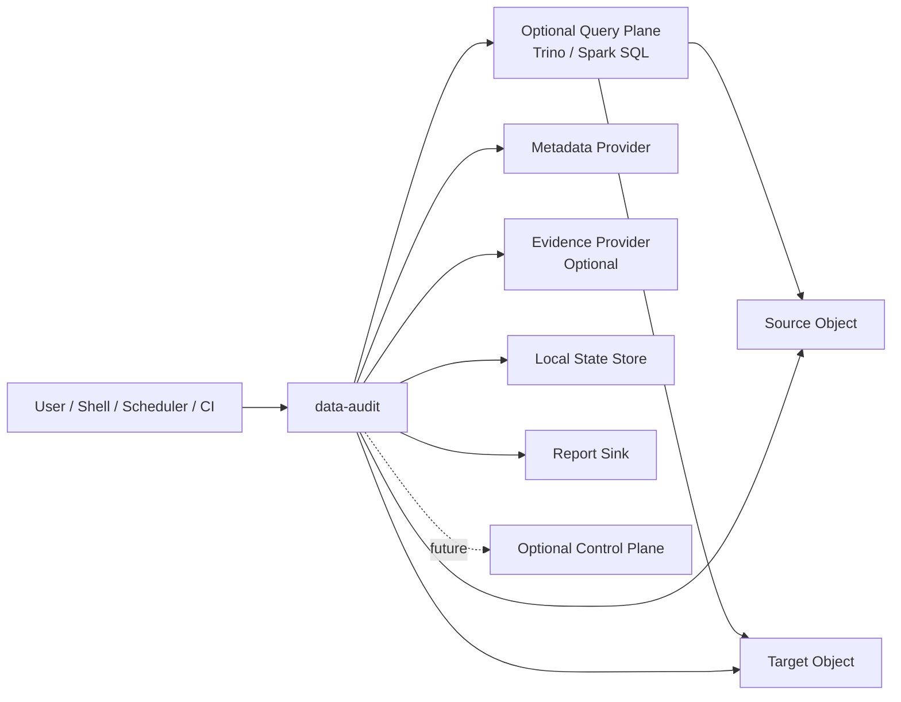
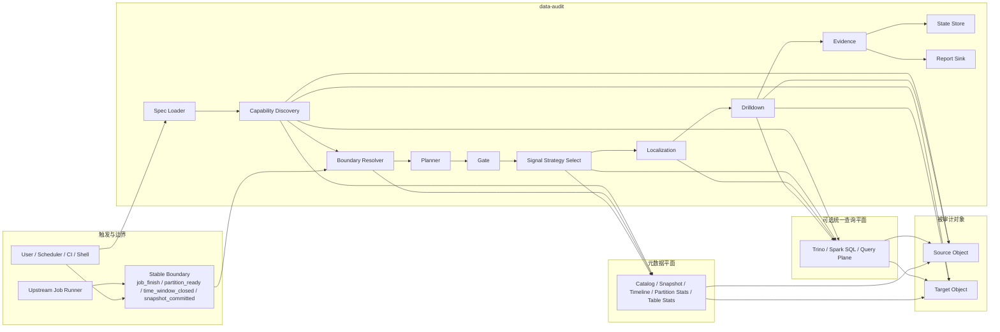
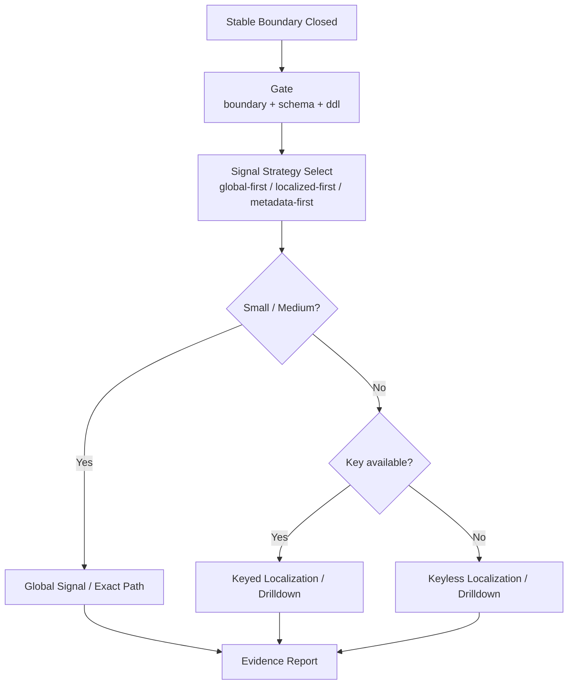
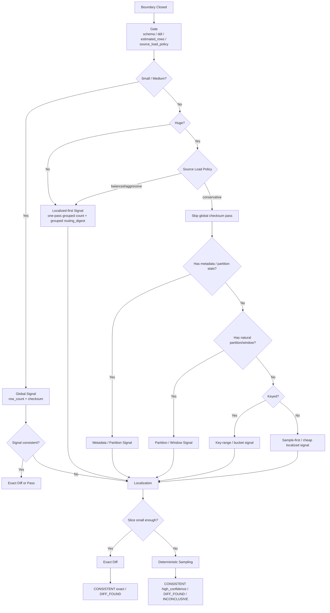
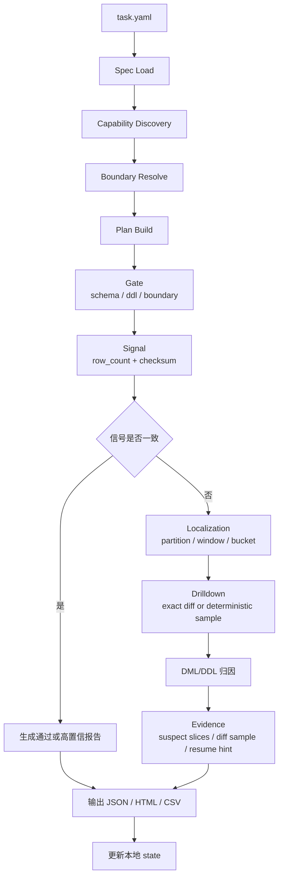
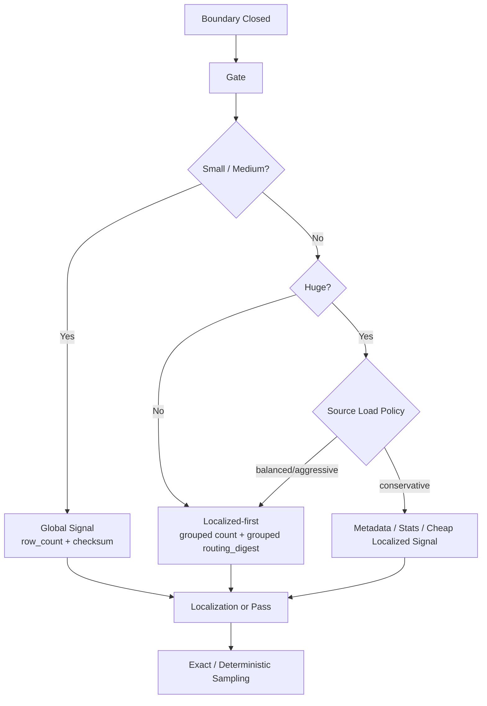
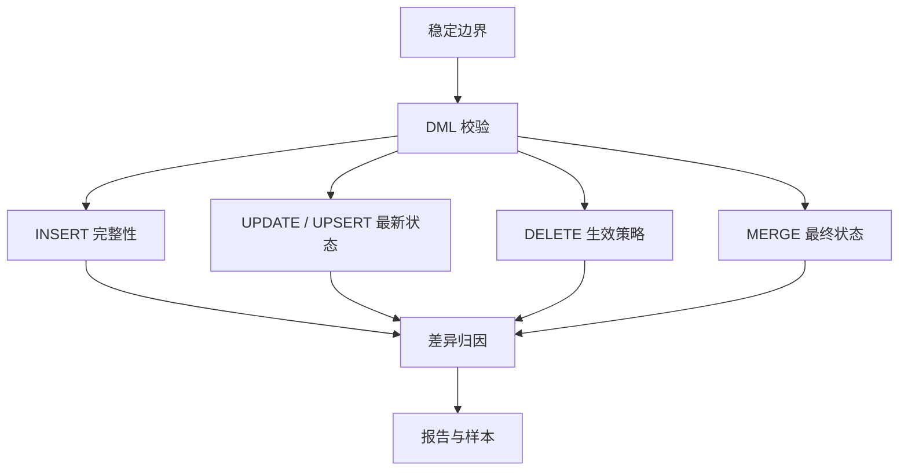
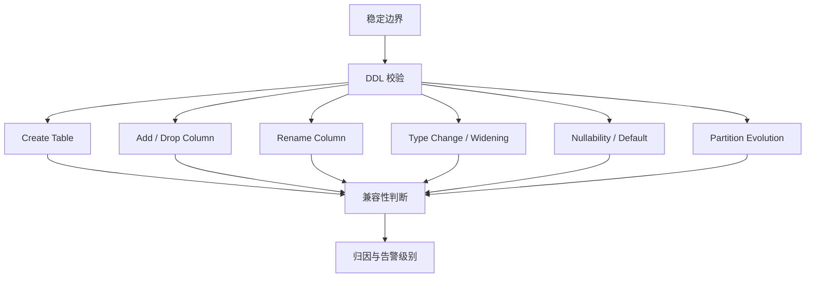

# data-audit 设计文档

> 本文从真实客户场景出发，定义 `data-audit` 的产品定位、差异化亮点、运行时架构、默认路径和扩展模型。

## 1. 背景

现有公开工具里，`dataCompare` 更偏数据库迁移/复制后的表对表比较：基于哈希并行比对，依赖 PostgreSQL repository，并带前端/UI 和一组数据库类型限制。这个方向适合数据库复制核验，但不等于大数据与湖仓场景下的任务后一致性审计。

在大数据 / 湖仓场景里，常见对象具备更复杂的边界和演进特征：

- Iceberg 支持 schema evolution 与 partition evolution，旧布局与新布局可以共存
- Hudi 的 timeline / completion time 决定一个提交边界何时可见
- Paimon 每次 commit 都会生成 snapshot，且 append table 可以没有主键
- Delta CDF 不是默认开启，并且在 column mapping 与非加性 schema change 下存在读取限制

因此，普通的“全表 hash compare”在这些场景里要么太贵，要么容易误报。

## 2. 客户场景与核心痛点

`data-audit` 首先解决的不是“如何再做一个 compare 工具”，而是一个在大数据链路里反复出现的客户问题：

> 数据同步或入湖任务结束后，客户知道任务“跑完了”，但不知道结果“是不是真的对了”。

在真实场景里，这个问题通常表现为 4 类痛点：

- 大表或分区表同步完成后，只能看到任务成功，无法快速确认结果是否一致。
- 一旦发现指标异常，排查成本很高，不知道问题落在哪个分区、哪个批次、哪个时间窗口。
- 表结构演进、字段重命名、类型 widening 或分区演进后，简单 hash compare 很容易误报。
- 系统异构严重，Oracle、Hive、Iceberg、结果表往往需要不同接入方式，导致校验链路本身就很重。

这说明客户真正需要的不是“再多一套规则”，而是一个低接入成本、能在大表场景下逐层缩圈、并且能够在稳定边界上给出可复查证据的审计能力。

## 3. 产品定位与边界

`data-audit` 的定位是：

> 一个面向大数据链路的边界后结果核验与一致性审计工具，用于在数据库、数仓、湖仓和结果表之间，在某个稳定边界上验证结果状态是否一致，并输出可定位、可复查的差异证据。

这里需要明确两层含义：

- 一级定位是“边界后的结果核验 / 一致性审计”，目标是回答任务完成后结果到底对不对、错在哪、能否继续复查。
- 统一查询平面只是接入与执行手段，用来降低异构系统的接入复杂度，并把 `signal / localization` 等计算尽量下推到引擎侧执行。

一级买点固定为：

- 低接入成本：优先通过统一查询平面或最小 connector 集合接入异构系统。
- 分层缩圈：默认执行模型是 `Gate -> Signal -> Localization -> Drilldown -> Evidence`。
- 可复现证据链：每次核验输出边界、路径、suspect slice、diff sample 和复查入口。

它首先服务于以下场景：

- 批式同步完成后的大表 / 分区表核验
- 数仓结果表或汇总表的定时一致性校验
- 入湖任务在 `snapshot` / `version` / `time_window` 边界上的结果复核
- 异构系统之间以 SQL 结果集为中心的统一校验

一句话概括：它解决的是“任务跑完以后，结果到底对不对，错在哪，值不值得继续下钻排查”。

### 3.1 目标客户与第一优先场景

当前第一优先客户，不是泛化的“所有大数据用户”，而是对批后结果正确性负责的数据平台与数据工程团队，典型包括：

- 负责数据库到数仓 / 湖仓同步验收的数据平台团队
- 负责结果表、汇总表、宽表定时复核的数据仓库团队
- 需要在发布、迁移、入湖完成后做结果签收的交付或运维团队

第一优先场景固定为：

- 大表 / 分区表在 `job_finish` 后的结果核验
- 入湖或入仓任务在 `snapshot` / `time_window` 边界上的结果复核
- 结果表按天 / 批次 / 分区的定时一致性校验

当前不作为第一优先的场景：

- 流内 `inline` 校验
- 通用数据质量规则治理
- 所有湖仓格式的同等深度原生审计

### 3.2 价值指标 / 成功标准

`data-audit` 的成功，不是“又多支持一个 connector”，而是让结果核验更快落地、更快排查、更容易复查。首页设计阶段建议固定以下成功标准：

- 接入成本：对可 SQL 化对象，优先复用统一查询平面或最小 connector 集合，不为每个源单独建设校验链路。
- 排查效率：一次异常核验后，报告能把范围收窄到分区 / 批次 / `time_window` / suspect slice，而不是只给全表失败。
- 证据可复查：报告至少包含 boundary、selected path、global signal、suspect slices、diff sample、resume hint。
- 大表友好：默认避免无条件全表 `exact diff`，只有 suspect slice 才继续下钻。
- 误报可控：对 schema evolution、rename、type widening、boundary drift 有清晰判定语义。

MVP 产品边界固定为：

- 单进程
- 单命令
- 单次任务运行
- 默认 CLI-only

未来可以扩展可选控制面，但只作为报告汇聚和策略编排层，不改变 CLI-first 边界。

### 非目标

- 不是通用数据质量规则平台，不以海量规则编排、质量评分、血缘治理为目标。
- 不是同步链路执行引擎，不参与 SeaTunnel / DataX / Flink CDC 等任务编排与写入过程。
- 不做同步链路中的 inline 校验，不判断流内中间态事件过程。
- 不是单纯的联邦查询工具；统一查询只是接入手段，目标仍然是结果校验与异常定位。
- 不做当前版本的平台、Web 管理端、租户系统、任务中心。
- 不是默认覆盖所有湖仓原生语义的全能平台；对 `snapshot-aware`、`metadata-first` 的强化应优先围绕真实高频场景逐步落地。

## 4. 产品亮点

### 4.1 可复现证据链

`data-audit` 不只输出一次性的 `pass / fail`，还要输出可以回放和复查的审计证据。一次核验至少应该沉淀：

- 边界指纹与比较时点
- planner 选择路径与 `decision trace`
- `signal` 指标与 suspect slice
- `diff sample`、归因结果与 `resume hint`

这使它更像审计产品，而不是一次性 compare 脚本；重点不只是“发现错”，而是“让下一轮复查能接着做”。

### 4.2 大表分层核验

`data-audit` 的默认路径不是全表拉回比对，而是统一走 `Gate -> Signal -> Localization -> Drilldown -> Evidence`。  
在 `keyed` 场景优先用业务键做缩圈，在 `keyless` 场景优先用逻辑行摘要做缩圈；`bucket` 是超大表的主缩圈手段，`sampling` 只作为超大 suspect slice 的兜底。对 `Oracle/OLTP` 这类重负载源，默认不把独立 `global checksum` 作为第一步，而是优先 `localized-first`。  
这让它更适合大表、分区表和批量结果表，而不是只适合小表全量 compare。

### 4.3 稳定边界感知

`data-audit` 比的不是“当前最新数据像不像”，而是“某个已提交边界上的结果状态是否一致”。  
`snapshot-aware + metadata-first` 的意义就在这里：

- `snapshot-aware`：先确认比较的是哪个 `snapshot`、`version`、`instant` 或 `time_window`，避免把时点漂移误判成数据异常。
- `metadata-first`：在真正扫描数据前，先用 `schema`、`snapshot`、`manifest`、`timeline`、`partition summary` 等元数据缩小范围，提高大表场景下的可解释性和排查效率。

### 4.4 统一查询平面

统一查询平面不是产品一级定位，而是 `data-audit` 为了降低接入与执行成本而引入的一层能力。  
客户最直观的成本来自接入复杂。`data-audit` 优先把查询入口统一起来，避免每遇到一种源端或目标端都引入一套独立校验链路。  
这使它在 Oracle、Hive、Iceberg、结果表等异构场景下，更容易落成一条统一的校验流程。

统一查询平面可以由 `Trino`、`Spark SQL Thrift Server` 等承担，其中 `Trino` 是更典型的候选实现：

- 它适合承接 Oracle / MySQL / PostgreSQL / Hive / Iceberg / 结果表等“可 SQL 化对象”
- 它适合把 `signal`、`localization` 这类聚合和切片逻辑下推到查询引擎执行
- 它降低的是接入成本和执行成本，不改变 `data-audit` 仍以结果核验、异常定位和可复查证据为目标

## 5. 为什么不是普通 SQL compare

普通 SQL compare 更适合小表、临时结果集或一次性人工对比。`data-audit` 不是要替代所有 compare，而是专门解决“边界后、大表、异构、可复查”的结果核验场景。

| 维度 | 普通 SQL compare | `data-audit` |
| --- | --- | --- |
| 比较对象 | 任意两个当前可查询结果集 | 某个稳定边界上的结果状态 |
| 默认执行 | 直接 compare 或全量 hash | `Gate -> Signal -> Localization -> Drilldown` |
| 大表策略 | 依赖调用方自己拆 SQL 或人工分区 | planner 自动缩圈到 suspect slice |
| 误报控制 | 依赖调用方自己处理时点和 DDL 差异 | 内建 boundary、DDL、metadata-first 语义 |
| 输出 | `pass / fail` 或差异行 | 报告、decision trace、suspect slice、resume hint |

因此，如果用户只需要临时性的小结果集比对，普通 SQL compare 已经足够；`data-audit` 只在需要边界语义、分层缩圈和证据复查时才有独立价值。

## 6. 核心设计原则

1. 不做同步中校验，只做边界后的结果审计。
2. 优先解决大表同步完成后的结果核验，再逐步扩展湖仓原生场景。
3. 优先统一查询接入，降低异构系统的校验门槛。
4. 校验对象是“已提交边界上的结果状态”，不是“流内中间事件过程”。
5. 默认由 planner 自动选择最小必要、可解释的审计路径。
6. `exact diff` 负责严格裁决；`sampling + signal` 最多只能给高置信结论。
7. `summary` 只负责路由，不负责解释一切。
8. `hash / digest / checksum` 只负责信号和缩圈，不负责最终裁决。
9. 先利用元数据、摘要、bucket 和切片逐层缩小范围，再做精确 diff 或抽样验证。
10. 报告、suspect slice 和 `resume hint` 是产品接口的一部分，不只是附属日志。
11. 对 DDL / schema evolution / partition evolution 做显式建模，不把所有变化都判成错误。
12. evidence 模式是可选增强，不是默认依赖。
13. 对无主键、大表、分区表场景保持可运行。
14. `data-audit` 默认是只读审计器，不写 source/target 业务数据。

## 7. 系统上下文

### 7.1 系统上下文图



系统边界说明：

- `source / target` 是被审计对象，不是同步链路的一部分
- `query plane` 是可选统一接入层，用于承接 SQL 访问与 `signal / localization` 下推，不是业务数据的权威来源
- `metadata provider` 可以是 catalog、manifest、timeline、version log 等边界信息来源
- `evidence provider` 是可选旁证来源，例如 CDC / CDF / audit log 导出
- `state store` 和 `report sink` 默认本地化
- `optional control plane` 只保留未来扩展位，不属于 MVP

### 7.2 与 dataCompare 的差异化

| 维度 | dataCompare | data-audit |
| --- | --- | --- |
| 产品形态 | 服务 + repository + UI | 单 CLI |
| 默认部署 | 依赖 PostgreSQL repository，README 列出前端依赖 | 本地状态即可运行，默认 SQLite / JSON |
| 默认对象 | 迁移/复制后的数据库表 | 数据库表、查询结果、湖仓表、文件集 |
| 默认边界 | 任务完成后表对表比对 | `job_finish` / `snapshot` / `version` / `instant` / `time_window` |
| 核心方法 | hash compare + 并行批处理 | planner 驱动的分层比较 |
| 大数据关注点 | 偏数据库迁移后比对 | 偏大表、分区、快照、实时任务结果校验 |
| DDL 处理 | 非核心卖点 | DDL evolution 是一等能力 |
| 输出 | 一致性结果 + repository 明细 | 根因分类 + suspect slice + diff sample + 报告文件 |

## 8. 对象分级与默认执行路径

`data-audit` 统一支持三类一等对象。兼容传统小表单次比对，是统一架构中的短路路径，不是独立产品模型。

| 对象类 | 典型 source / target | 典型 boundary | 默认 planner 路径 | 是否优先 metadata | 是否依赖主键 | 最终证据 |
| --- | --- | --- | --- | --- | --- | --- |
| `small_table_once` | JDBC 表、结果集、导出文件 | `job_finish` | `Gate -> Signal -> Exact Diff` | 否 | 建议有主键，但无主键仍可 multiset diff | row diff、sample diff |
| `partitioned_big_table` | 大表、分区表、时间分片对象 | `job_finish` / `partition` / `time_window` | `Gate -> Signal -> Localization -> Drilldown` | 可选 | 不强依赖 | suspect slices、diff sample、resume hint |
| `lakehouse_object` | Iceberg / Hudi / Delta / Paimon | `snapshot` / `version` / `instant` / `time_window` | `Gate -> Metadata Signal -> Localization -> Drilldown` | 是 | 不强依赖 | snapshot/timeline info、suspect slices、diff sample |

说明：当前第一优先的客户场景是 `partitioned_big_table`；`lakehouse_object` 是面向 `snapshot-aware` 与 `metadata-first` 的高级能力，不应作为首页默认落点。

默认策略：

- 小表：尽可能直接精确比对
- 大表 / 分区表：先做全局 signal，再做分区或 bucket 缩圈，最后进入 exact diff 或 sample drilldown
- 湖仓对象：先读取边界元数据，再进入统一分层比较
- 无稳定边界：拒绝执行

### 8.1 能力成熟度矩阵

下表描述的是当前产品承诺级别，不等同于所有能力已经在同一成熟度上实现：

| 能力方向 | 当前承诺级别 | 主要场景 | 说明 |
| --- | --- | --- | --- |
| `partitioned_big_table` 批后结果核验 | 第一优先 | 大表 / 分区表同步完成后 | 首页主场景，默认路径是 `Gate -> Signal -> Localization -> Drilldown` |
| 结果表定时复核 | 第一优先 | 汇总表 / 宽表 / 指标表 | 强调低接入成本、定时执行和可复查报告 |
| Iceberg `snapshot-aware` 审计 | 重点增强 | 入湖后 `snapshot` / `version` / `time_window` | 作为二级差异化能力持续增强 |
| 统一查询平面（`Trino` 等） | 执行增强能力 | SQL 化对象接入、`signal / localization` 下推 | 是接入与执行手段，不是产品一级定位 |
| Hudi / Delta / Paimon 原生边界审计 | 分阶段推进 | 多湖仓格式统一支持 | 不承诺与 Iceberg 同时达到同等成熟度 |
| 流内 `inline` 校验 / 通用规则平台 | 非目标 | streaming in-flight / 数据治理平台 | 当前产品边界外 |

## 9. 运行时拓扑

### 9.1 运行时拓扑图



主图说明：

- `Stable Boundary` 是进入 `data-audit` 的前提；没有稳定边界，planner 应拒绝执行。
- `Query Plane` 是可选执行面，用来承接低接入成本查询与 `signal / localization` 聚合，不是产品定位本身。
- `Metadata Plane` 与 `Query Plane` 是并行辅助面；前者偏边界真值和统计，后者偏查询执行和聚合下推。
- `Gate / Signal Strategy / Localization / Drilldown / Evidence` 是运行核心，分别回答“能不能比、先怎么比、缩到哪里、怎么下钻、留下什么证据”。
- `State Store` 和 `Report Sink` 不是附属组件，而是产品接口的一部分，用于恢复、复查和趋势复盘。
- `Source / Target` 是被审计对象，不是同步链路的一部分；`data-audit` 默认只读，不写业务数据。

### 9.2 运行时分层

#### `CLI Frontend`

负责命令解析、配置加载、日志、错误码、输出目录和运行参数。

#### `Planning Core`

负责 capability discovery、boundary resolve、对象分级、比较路径选择和执行计划生成。

#### `Execution Core`

负责分层执行、segment 切片、精确 diff、DML/DDL 归因、失败恢复。

#### `Query Plane Adapter`

负责对接 `connector-trino`、`connector-sparksql` 一类统一查询平面，把 SQL 化对象的读取、聚合和切片尽量下推到引擎侧执行。  
它的职责是收敛接入和执行成本，而不是替代原生 lakehouse metadata reader。

#### `State and Report`

负责运行状态持久化、suspect slice 记录、报告生成、报告展示与复查入口。

#### `Optional Control Plane`

未来可选扩展位，仅用于报告汇聚、模板中心、任务目录和趋势分析，不作为当前执行依赖。

## 10. 边界模型

`data-audit` 只接受稳定边界上的校验请求。建议支持以下边界类型：

- `job_finish`
- `snapshot`
- `version`
- `instant`
- `time_window`
- `partition`

边界规则：

- 没有稳定边界时，拒绝执行
- 对实时任务，只校验已提交边界后的结果状态
- 不对 `in-flight` 状态做判断
- 边界一旦在执行期漂移，应终止或返回不稳定状态

这和 CDC / 湖仓系统的自然边界是一致的：

- Flink CDC 先事件建模 schema，再处理数据变化
- Hudi 以完成态 commit 作为更稳定边界
- Delta 的 change data 与 transaction 同时可见
- Paimon 每次 commit 生成 snapshot

## 11. 能力模型与 SPI 架构

`reader-spi` 之上需要再抽一层 `capability model`，避免后续 reader 只按数据源类型扩展，缺乏统一的能力描述。

### 11.1 能力类型

| 能力 | 作用 |
| --- | --- |
| `DataReadCapability` | 是否支持读取数据行、指定列、指定过滤条件 |
| `MetadataReadCapability` | 是否支持读取 schema、stats、manifest、timeline、version metadata |
| `EvidenceReadCapability` | 是否支持读取外部 CDC / CDF / audit log 旁证 |
| `PartitionPruneCapability` | 是否支持按分区、范围、window 裁剪 |
| `SnapshotBoundaryCapability` | 是否支持 `snapshot / version / instant` 一类稳定边界 |
| `QueryPushdownCapability` | 是否支持把 `summary` / `segment` SQL 下推到统一查询平面或底层引擎 |

### 11.2 Reader 需要暴露的能力面

reader 不只是“能不能读”，还必须暴露：

- 是否支持 `snapshot / version / instant`
- 是否支持分区裁剪
- 是否支持列下推
- 是否支持 `summary` / `segment` 聚合下推
- 是否支持无主键 `multiset compare`
- 是否能返回原生摘要、manifest、timeline 或 version metadata

### 11.3 预留的关键概念类型

后续接口文档应围绕以下概念展开：

- `CapabilityDescriptor`
- `ExecutionPlan`
- `SegmentDescriptor`

这些类型的职责分别是：

- `CapabilityDescriptor`：描述 reader 的能力矩阵和限制
- `ExecutionPlan`：描述 planner 生成的对象类、路径、层级、边界与恢复策略
- `SegmentDescriptor`：描述 suspect slice、segment key、范围和复查入口

## 12. Planner 决策内核

planner 的职责不是“选算法”，而是基于对象能力、边界稳定性和预估成本，选择最小成本、可解释、可复查的审计路径。

### 12.1 Planner 输入

- `boundary.type`
- `source.type`
- `target.type`
- `planner.hints.estimated_rows`
- `planner.hints.partition_keys`
- `object.key`
- `metadata capability`
- `evidence availability`
- `planner.hints.force_exact_diff`
- `planner.hints.prefer_metadata`

### 12.2 Planner 输出

- `object_class`
- `selected_path`
- `executed_levels`
- `short_circuit_reason`
- `refuse_reason`
- `resume_strategy`

### 12.3 Planner 决策图



### 12.4 `keyed / keyless` 路径与 hints

硬约束：

- `keyed / keyless` 的分歧发生在 `Localization / Drilldown`，不是在 `Gate`。
- 对超大表，planner 应先决定 `signal strategy`，再决定进入 `keyed` 或 `keyless` 路径。

`keyed` 路径：

```mermaid
flowchart TD
  A[Signal Strategy Selected<br/>need localization] --> B{Has natural partition/window?}
  B -- Yes --> C[Grouped Signal<br/>by dt / batch_id / partition]
  B -- No --> D[Virtual Buckets<br/>bucket = hash(key) mod N]
  C --> E[Suspect Slices]
  D --> E
  E --> F{Slice small enough?}
  F -- Yes --> G[Exact Keyed Diff]
  F -- No --> H{Can refine more?}
  H -- Yes --> I[Increase bucket count<br/>256 -> 1024 -> 4096]
  H -- No --> J[Deterministic Sample<br/>sample by hash(key)]
  I --> E
  J --> K[Sample Keyed Diff]
  G --> L[Strict Verdict<br/>CONSISTENT exact / DIFF_FOUND]
  K --> M[Confidence Verdict<br/>DIFF_FOUND / CONSISTENT high confidence]
```

`keyless` 路径：

```mermaid
flowchart TD
  A[Signal Strategy Selected<br/>need localization] --> B{Has natural partition/window?}
  B -- Yes --> C[Grouped Signal<br/>by dt / batch_id / partition]
  B -- No --> D[Virtual Buckets<br/>bucket = hash(row_digest) mod N]
  C --> E[Suspect Slices]
  D --> E
  E --> F{Slice small enough?}
  F -- Yes --> G[Exact Multiset Diff]
  F -- No --> H{Can refine more?}
  H -- Yes --> I[Increase bucket count<br/>256 -> 1024 -> 4096]
  H -- No --> J[Deterministic Sample<br/>sample by hash(row_digest)]
  I --> E
  J --> K[Sample Multiset Diff]
  G --> L[Strict Verdict<br/>CONSISTENT exact / DIFF_FOUND]
  K --> M[Confidence Verdict<br/>DIFF_FOUND / CONSISTENT high confidence]
```

```yaml
planner:
  mode: auto               # auto | exact_first | segment_first | metadata_first
  hints:
    object_class: auto     # auto | small_table_once | partitioned_big_table | lakehouse_object
    estimated_rows: null
    partition_keys: []
    max_exact_rows: null
    force_exact_diff: false
    prefer_metadata: true
```

推荐语义：

- `mode=auto`：默认行为，由 planner 自动决定路径
- `exact_first`：优先尝试小表式精确比对
- `segment_first`：优先按自然分区、时间窗口或 bucket 缩小范围
- `metadata_first`：优先使用 manifest / timeline / snapshot metadata 作为 signal 增强
- 没有自然 segment 或 metadata hint，不应直接拒绝执行；默认退化到虚拟 bucket，再决定是否需要 sampling
- `sampling` 只在 suspect slice 仍然过大且无法继续细分时触发

planner 在使用 `hash / checksum / digest` 信号时，必须遵守两条硬规则：

- hash 结果不能单独构成“严格通过”结论，只能作为进入下一层、停止下钻或给出高置信判断的依据之一
- 只要 `row_count`、DDL 兼容性或关键诊断信号冲突，就不能因为 hash 一致而给出 `CONSISTENT exact`

### 12.5 超大表信号预算决策图



超大表硬规则：

- “只做 hash”不等于更轻；hash 也是扫描与计算，不应被误认为免费优化。
- 如果最终还要做 `bucket` 或 `localized signal`，就不应先扫一遍独立 `global checksum pass`，再扫第二遍做缩圈。
- 对超大表跳过的不是 `signal`，而是“独立的 global checksum pass”；替代路径应是 `metadata / stats / localized-first`。

## 13. 执行核心与生命周期

### 13.1 六阶段生命周期

| 阶段 | 说明 |
| --- | --- |
| `Spec Load` | 读取 `task.yaml`、环境变量和运行参数 |
| `Capability Discovery` | 收集 source / target / metadata / evidence 的能力矩阵 |
| `Boundary Resolve` | 解析并验证边界是否稳定 |
| `Plan Build` | 生成对象分级、路径、层级、切片和恢复策略 |
| `Layered Execute` | 执行 gate、signal、localization、drilldown 与 evidence 生成 |
| `Report Persist` | 写入 state、报告和 suspect slice 索引 |

### 13.2 执行控制语义

- 单次执行必须幂等
- 中断后允许基于 state 恢复 suspect slice
- `partial segment` 完成要保留中间状态并返回退出码 `4`
- `boundary` 不稳定时直接拒绝，不进入执行
- evidence 不可用时允许降级，但必须在报告中说明

### 13.3 分层执行主流程



### 13.4 首版 Connector 与统一查询平面策略

当前工程实现固定采用：`connector-jdbc` 打底，`connector-iceberg` 先行。  
从设计演进上看，还需要预留 `connector-trino` 这类统一查询平面，用来承接低接入成本的大数据结果校验场景。

这里的设计边界需要再次强调：统一查询平面属于执行层与接入层能力，不改变产品的一级定位仍然是“边界后的结果核验 / 一致性审计”。

原因不是为了减少支持范围，而是为了把复杂度压在正确的层次：

- `connector-jdbc` 负责承接数据库表、任意 SQL 查询结果，以及 Hive JDBC / Doris JDBC 这类“可 SQL 化对象”
- `connector-trino` 负责承接统一查询平面，把 Oracle / Hive / Iceberg / 结果表等 SQL 接入收敛到一层，并把 `signal / localization` 聚合下推到查询引擎
- `connector-iceberg` 负责承接首个真正的湖仓原生能力验证，重点是 `snapshot-aware + metadata-first`
- planner、signal、localization、diff、DML auditor、DDL auditor 只在 `core` 保留一套，connector 不复制比较逻辑

首版范围明确如下：

| connector | 首版覆盖对象 | 首版能力 | 首版不承诺 |
| --- | --- | --- | --- |
| `connector-jdbc` | PostgreSQL / MySQL / Hive JDBC / Doris JDBC / 其他可 SQL 化对象 | `DataReader`、`MetadataReader`、分区裁剪、列投影、schema/signal/localization/drilldown 全链路 | snapshot/version/instant 原生边界、manifest/timeline 元数据 |
| `connector-trino` | Oracle / MySQL / PostgreSQL / Hive / Iceberg / 其他可通过 Trino catalog 暴露的对象 | 统一 SQL 接入、结果集读取、`signal / localization` 聚合下推、低接入成本接入异构系统 | lakehouse 原生边界的完整真值、manifest/timeline 权威元数据、替代原生 metadata reader |
| `connector-iceberg` | Iceberg 表 | snapshot 边界、schema、manifest、partition summary、原生数据读取、suspect segment hint | CDC/evidence reader、row-level change 专用 reader |

这意味着：

- Hive 与 Doris 首版统一通过 `type: jdbc` 接入，而不是立刻做 native connector
- 当用户需要的是“能查数据、能比结果、能做分区切片”，JDBC 已经足够
- 当用户需要的是“统一 SQL 接入 + 低接入成本 + 在引擎侧完成 signal/localization 聚合”，优先引入 `connector-trino`
- 当用户需要的是 `snapshot / manifest / partition summary` 等原生元数据能力时，首版优先支持 Iceberg
- `jdbc <-> iceberg` 当前已具备真实数据读取与 diff 能力，不再把 `PARTIAL` 作为 Iceberg 的常态结果
- 统一查询平面是可选部署，不应成为所有场景的强依赖

建议的职责边界：

- `connector-trino` 解决“怎么统一接入、怎么把聚合下推到引擎侧”
- 原生 lakehouse connector 解决“怎么获取 `snapshot / version / instant / manifest / timeline` 真值”
- planner 负责在“统一查询平面”和“原生元数据路径”之间选择最小必要路径

JDBC 方言首版采用最小抽象，建议通过 `source.options.dialect` / `target.options.dialect` 显式声明：

- `postgres`
- `mysql`
- `hive`
- `doris`

如果未显式配置，运行时可以根据 JDBC URL 做有限推断；但文档和模板仍建议显式声明，减少歧义。

## 14. 分层比较模型

### 14.1 五段式执行模型

`data-audit` 的主执行模型统一为：

`Gate -> Signal -> Localization -> Drilldown -> Evidence`

各层职责固定如下：

- `Gate`：确认边界稳定、schema / DDL 兼容、对象规模与可用能力。
- `Signal`：只用最低成本信号判断“当前范围是否值得继续下钻”；默认最小信号包是 `row_count + checksum`，但对超大保守源不要求先跑独立全局 checksum。
- `Localization`：当信号显示需要继续缩圈时，把问题缩到分区、时间窗口或虚拟 bucket。
- `Drilldown`：对 suspect slice 做精确比对；如果 slice 仍过大，则退化到确定性抽样。
- `Evidence`：输出 suspect slice、diff sample、decision trace、resume hint 和最终归因。

这五段式模型同时适用于 `keyed` 与 `keyless` 场景，只是在 `Localization` 与 `Drilldown` 的实现上分叉。

### 14.2 信号分层

为了避免把所有摘要都塞进 `Signal` 一词，文档固定使用三类信号：

| 信号层 | 作用 | 常见输入 | 是否允许整表扫描 |
| --- | --- | --- | --- |
| `Gate Signal` | 决定能否开始执行，以及默认走哪条路径 | `boundary stable`、`schema / ddl compatibility`、`estimated_rows`、stats 新鲜度、`source_load_policy` | 否 |
| `Routing Signal` | 决定是否需要缩圈，以及缩到哪里 | metadata row count、partition stats、global `row_count`、global `checksum`、grouped count、grouped `routing_digest` | 视表规模与源类型而定 |
| `Evidence Signal` | 只在 suspect slice 上增强证据强度 | `row_digest`、sample diff、row/column consistency、key coverage | 仅 suspect slice |

信号层硬规则：

- 超大表默认先决定 `signal strategy`，再决定是否进入 `keyed / keyless` 路径。
- `row_count + checksum` 是默认最小信号包，但不是“所有规模都必须先全局执行”的硬前置。
- 对超大保守源，第一轮信号允许退化成 `metadata row count / partition stats / grouped count / grouped routing_digest`。

超大表 signal 决策图：



### 14.3 `keyed / keyless` 双路径

`keyed / keyless` 的分歧发生在 `Localization / Drilldown`，不是在 `Gate`；对超大表，必须先选定 signal strategy，再进入双路径。

| 路径 | Localization 主手段 | Drilldown 主手段 | Sampling 基础 | 最强结论 |
| --- | --- | --- | --- | --- |
| `keyed` | 自然分区、时间窗口、`bucket = hash(key) mod N` | `exact keyed diff` | `hash(key)` | `CONSISTENT exact / DIFF_FOUND` |
| `keyless` | 自然分区、时间窗口、`bucket = hash(row_digest) mod N` | `exact multiset diff` | `hash(row_digest)` | `CONSISTENT exact / DIFF_FOUND` |

两条路径的共同原则：

- 优先用自然分区或时间窗口缩圈。
- 没有自然切片时，退化到虚拟 bucket，而不是直接放弃比对。
- `sampling` 只在 suspect slice 仍然过大、无法继续细分时触发。
- sampling 发现异常可以直接给 `DIFF_FOUND`；sampling 一致只能给 `CONSISTENT high confidence`。

### 14.4 指标分层表

| 分层 | 指标 | 作用 | keyed 是否适用 | keyless 是否适用 | 是否默认执行 |
| --- | --- | --- | --- | --- | --- |
| Gate | `boundary stable` | 判定能否开始比对 | 是 | 是 | 是 |
| Gate | `schema / ddl compatibility` | 判定 hash 与 diff 语义是否成立 | 是 | 是 | 是 |
| Routing Signal | `row_count` | 最基础的总量信号 | 是 | 是 | 是 |
| Routing Signal | `checksum` | 最核心的内容信号 | 是 | 是 | 是 |
| Localization Signal | `grouped row_count` | 在 partition / window / bucket 层缩圈 | 是 | 是 | 是 |
| Localization Signal | `grouped checksum` | 在 partition / window / bucket 层缩圈 | 是 | 是 | 是 |
| Localization Signal | `virtual bucket id` | 无自然分区时的缩圈手段 | 是 | 是 | 是 |
| Diagnostic | `null_count` | 辅助判断空值漂移 | 是 | 是 | 条件保留 |
| Diagnostic | `min/max` | 辅助判断窗口错位、数值截断 | 是 | 是 | 条件保留 |
| Diagnostic | `key coverage` | 判断 key 缺失 / 新增 / 重复 | 是 | 否 | 非默认 |
| Diagnostic | `row consistency` | 交集记录的内容一致率 | 是 | 否 | 非默认 |
| Diagnostic | `column consistency` | 判断哪列最容易出问题 | 是 | 部分 | 非默认 |
| Evidence | `diff sample` | 给复查和 RCA 用 | 是 | 是 | suspect 后执行 |
| Evidence | `suspect slice list` | 报告异常范围 | 是 | 是 | suspect 后执行 |

以下量化率更适合作为报告 KPI 或 suspect slice 诊断指标，而不是默认全表执行指标：

- 行数一致率：`row_count` 的展示型变体，适合报告总览，不适合单独跑一套执行链路。
- 主键覆盖率：仅在 `keyed` 场景有高价值，适合作为 suspect slice 诊断，不适合默认全局执行。
- 行级一致率：非常接近“内容一致率”，但更适合在 sample 或 suspect slice 上计算。
- 字段级一致率：适合 RCA，不适合默认全表计算。

### 14.5 默认保留 / 删除清单

默认保留的最小闭环：

- `row_count`
- `checksum`
- `grouped row_count`
- `grouped checksum`
- `virtual bucket`
- `diff sample`
- `suspect slice list`

条件保留：

- `null_count`
- `min/max`

保留原则：

- 只对关键列做
- 只在 `standard / deep` profile 或 suspect slice 上做
- 不默认对全列启用

推荐只用于：

- 分区列
- 时间列
- 关键业务指标列
- key 列附近的辅助列

默认删除或降级出主链路：

- `approx_distinct`
- `partition_summary` 作为独立 summary 指标
- 全局 `key coverage`
- 全局 `row consistency`
- 全局 `column consistency`

原因如下：

- `approx_distinct` 成本高、语义容易失真、不是主缩圈信号。
- `partition_summary` 本质属于 grouped signal，不应再单独算成一类 summary。
- `key coverage / row consistency / column consistency` 很有价值，但更适合作为 suspect slice 诊断指标，不适合默认全表执行。

补充说明：

- `row_count + checksum` 是默认最小信号包，不代表所有规模都必须先跑独立全局 `row_count + checksum`。
- 对超大保守源，默认最小信号包会退化成 `metadata row count / partition stats / grouped count / grouped routing_digest`。

### 14.6 Hash 规则

默认规则：

`row_digest = hash(normalized projected row)`

默认列选择顺序：

1. `compare.signal.columns`
2. `object.columns.include`
3. 自动选择可稳定比较列

系统自动补入：

- key 列
- segment 列
- 必要 boundary 列

默认排除：

- `blob / clob / binary`
- 不可稳定 canonicalize 的复杂类型
- 超大文本列
- 物理审计列、落盘路径、ingest 元数据

Hash 计算前必须先完成逻辑归一化：

- 固定列投影与列顺序
- 应用 `rename_mapping`、`type_rules`、timezone、decimal scale、trim、casefold、empty-as-null 等规则
- 固定 null 表达
- 复杂类型只有在可稳定 canonicalize 时才参与 hash

聚合规则建议定义为顺序无关集合签名：

- `row_count`
- `sum(row_digest)`
- `xor(row_digest)`

术语约定：

- `routing_digest`：用于缩圈的低成本 digest，默认优先用于 grouped signal 和 bucket
- `row_digest`：单行摘要
- `checksum`：一批行摘要的集合签名
- `bucket digest`：某个分区 / bucket / 时间窗口内的 grouped checksum

额外约束：

- hash 不是免费优化，hash 本身也是扫描与计算。
- hash 只负责 signal 和 localization，不负责最终裁决。
- Summary 与 bucket 层的 hash 必须顺序无关、可并行聚合。
- file hash、manifest hash、对象存储 ETag 不能直接替代逻辑数据 hash。
- 更强的 hash 算法可以降低碰撞概率，但不能替代 exact diff。

### 14.7 分桶与抽样

默认优先级：

1. metadata / stats
2. 自然分区
3. 时间窗口
4. 虚拟 bucket
5. bucket 内确定性抽样
6. exact diff

bucket 默认方案：

- `keyed`：`bucket = hash(key) mod N`
- `keyless`：`bucket = hash(row_digest) mod N`

默认 `N` 递进：

- `256`
- `1024`
- `4096`

每个 bucket 默认只算：

- `count`
- `checksum`

有 key 时可附加：

- `key_min`
- `key_max`

但 `key_min / key_max` 只作为报告辅助，不作为核心路由指标。

sampling 默认方案：

- 只在 suspect bucket 仍然太大，或无法继续细分但又不能直接 exact 时触发
- keyed：`hash(key) mod M < r`
- keyless：`hash(row_digest) mod M < r`

sampling 的职责固定为：

- 发现异常可以直接给 `DIFF_FOUND`
- 抽样一致只能给 `CONSISTENT high confidence`
- 不能替代 `CONSISTENT exact`

设计收敛原则：

- `summary` 只负责路由，不负责解释一切。
- `global checksum` 只适用于小中表或低成本执行面；对超大保守源，`localized-first` 比 `global-first` 更合理。
- `bucket` 的价值在于覆盖全范围并缩圈，不在于比 hash 更便宜；如果最终还要做 bucket，就不应先做独立 `global checksum pass`。
- `sampling` 只做兜底，不做主路径。
- `sampling` 只在超大 suspect slice 上兜底，不能伪装成 `exact`。
- `OLTP/JDBC` 与 `MPP/Lakehouse/Trino` 的默认策略应该不同。
- `keyed` 与 `keyless` 都是一等场景，但共用同一套 `Gate -> Signal -> Localization -> Drilldown -> Evidence` 框架。

## 15. DML 结果审计策略



### INSERT

目标不是“原始插入事件条数相等”，而是：

- 这个边界内应新增的数据是否都到账
- 是否出现重复
- 是否存在延迟未到账

### UPDATE / UPSERT

默认以 `latest_state` 为主，而不是比较“更新次数是否一致”。在湖仓场景里，同一次 update 的物理表达可能是 file rewrite、delete file + new file，或通过 version / CDF 重建。对业务更稳定的是边界结束后的最终镜像。

### DELETE

DELETE 需要做成可配置策略：

- `hard_delete`：目标必须不存在
- `soft_delete`：目标必须有删除标记
- `delete_marker`：目标必须存在等价删除事件或标记

### MERGE

MERGE 的校验定义为：按 key 校验最终状态是否正确，而不是对齐所有中间事件。这更适合 Delta MERGE、Iceberg row-level change、Hudi / Paimon upsert 一类场景。

## 16. DDL 演进审计策略



建议把 DDL 校验做成三档：

- `strict`：逻辑/物理都严格一致
- `compatible`：允许兼容演进，但必须有映射和规则
- `logical_only`：只校验逻辑 schema，不把物理布局变化当错误

需要显式支持：

- `rename_mapping`
- `type_rules`，如 `widen_only`
- `partition_evolution`
- `nullable/default` 容忍策略

## 17. 状态与报告生命周期

### 17.1 State 生命周期

`state-store` 默认本地化，可使用 SQLite 或 JSON manifest。建议保存：

- `run_id`
- `boundary_fingerprint`
- `selected_path`
- `completed_segments`
- `suspect_segments`
- `resume_token`
- `report_index`

State 的主要作用：

- 保证重复执行可追踪
- 允许中断后恢复 suspect slice
- 为后续 `diff` / `report show` 提供上下文

### 17.2 报告生命周期

报告不只是“最终产物”，而是产品接口的一部分。建议分三层：

- `plan summary`
- `comparison result`
- `evidence & samples`

建议输出：

- `report.json`
- `report.html`
- `suspect_segments.csv`
- `row_diff_sample.csv`
- `manifest.json`

### 17.3 建议的报告字段

```json
{
  "plan": {
    "object_class": "lakehouse_object",
    "selected_path": "Gate -> Metadata Signal -> Localization -> Drilldown",
    "executed_levels": ["gate", "metadata_signal", "localization", "drilldown", "evidence"],
    "signal_strategy": "localized-first",
    "source_load_policy": "conservative",
    "boundary": {
      "type": "snapshot",
      "reference": "latest"
    },
    "reason": "metadata capability available and estimated_rows > max_exact_rows"
  },
  "result": {
    "status": "DIFF_FOUND",
    "confidence": "exact",
    "comparison_mode": "exact",
    "signal_backend": "trino_grouped_signal",
    "global_signal_skipped": true,
    "root_cause": "missing_rows_in_partition",
    "suspect_segments": [
      "dt=2026-03-10"
    ],
    "resume_hint": "data-audit diff -f task.yaml --segment dt=2026-03-10"
  }
}
```

建议额外说明以下术语：

- `signal_strategy`：本次执行采用的是 `global-first`、`localized-first` 还是 `metadata-first`。
- `source_load_policy`：planner 对源端负载采用的默认保护级别，如 `conservative`。
- `signal_backend`：signal 实际由谁计算，例如 `jdbc_pushdown`、`trino_grouped_signal`、`metadata_stats`。
- `global_signal_skipped`：表示本次明确跳过了独立 `global checksum pass`，并不是“没有做 signal”。
- `localized-first`：表示第一次高成本信号动作直接产出分区 / bucket 级 grouped signal，而不是先做全局 checksum 再缩圈。

### 17.4 `report show` 的目标

`report show` 不只是看结果，还要回答两件事：

- 为什么这次走的是这条比较路径
- 下次如何拿 suspect slice 继续复查

## 18. 配置模型

```yaml
task:
  name: orders_reconcile
  description: "orders 实时入湖任务的边界后校验"
  mode: post_check

boundary:
  type: snapshot            # job_finish | snapshot | version | instant | time_window | partition
  reference: latest
  grace_period: 5m

source:
  type: jdbc
  url: jdbc:postgresql://source:5432/app
  username: app
  password: ${SRC_PASSWORD}
  query: |
    select order_id, status, amount, update_time, dt
    from public.orders
    where dt = '2026-03-10'
  options:
    dialect: postgres

target:
  type: iceberg
  catalog: prod
  database: dw
  table: orders
  snapshot_id: latest

object:
  key:
    - order_id
  columns:
    include:
      - order_id
      - status
      - amount
      - update_time
      - dt

planner:
  mode: auto               # auto | exact_first | segment_first | metadata_first
  hints:
    object_class: auto     # auto | small_table_once | partitioned_big_table | lakehouse_object
    estimated_rows: 5000000
    partition_keys:
      - dt
    max_exact_rows: 100000
    force_exact_diff: false
    prefer_metadata: true

normalization:
  timezone: Asia/Shanghai
  trim_string: true
  empty_as_null: true
  case_insensitive_columns:
    - status
  decimal_scale:
    amount: 2

compare:
  levels:
    - gate
    - signal
    - localization
    - drilldown
  signal:
    profile: standard
    columns:
      - order_id
      - amount
      - update_time
      - dt
    hash:
      enabled: true
      algorithm: xxh64           # 示例值，不构成协议承诺
      ignore_row_order: true
      canonicalize_complex_types: false
      collision_policy: escalate_to_exact
  segment:
    by:
      - dt
    chunk_rows: 1000000
    virtual_bucket:
      initial_count: 256
      max_count: 4096
  diff:
    max_samples: 500
    exact_when_suspect: true
  sampling:
    mode: fallback_only
    target_rows: 100000

dml:
  insert: completeness
  update: latest_state
  delete:
    mode: hard_delete       # soft_delete | delete_marker
  merge: latest_state

ddl:
  mode: compatible          # strict | compatible | logical_only
  rename_mapping:
    old_amount: amount
  type_rules:
    - from: int
      to: bigint
      action: allow
    - from: float
      to: double
      action: warn
  partition_evolution: allow

evidence:
  enabled: false
  type: none                # debezium_export | delta_cdf_export | hudi_cdc_export | audit_log

output:
  dir: ./reports/orders_reconcile
  format:
    - json
    - html
    - csv

state:
  backend: sqlite
  path: ./.recon/state.db
```

### 18.1 Hash 配置说明

- `compare.signal.columns`：定义参与 `row_digest` 的默认列集合；如果未配置，则回退到 `object.columns.include` 或自动推断的稳定列
- `compare.signal.hash.enabled`：是否启用 Signal 层 hash
- `compare.signal.hash.algorithm`：示例中使用 `xxh64`，强调的是“可并行、低成本、顺序无关”，不是协议锁定
- `compare.signal.hash.ignore_row_order`：必须默认开启，避免把物理读取顺序误当作逻辑差异
- `compare.signal.hash.canonicalize_complex_types`：如果为 `false`，复杂类型应排除在 hash 之外或改走 exact diff
- `compare.signal.hash.collision_policy=escalate_to_exact`：一旦出现摘要冲突或业务要求严格证明，一律升级到 exact diff
- `compare.segment.virtual_bucket.*`：用于无自然分区场景下的缩圈，不等同于最终一致性结论
- `compare.sampling.*`：只在 suspect slice 仍然过大时触发，是兜底能力，不是主路径

### 18.2 配置样例解读

上面的配置更适合“分区大表 + 湖仓 snapshot”场景。其含义是：

- 先用 `planner` 根据 `estimated_rows`、`partition_keys`、`prefer_metadata` 选择默认路径
- Signal 层默认只用 `row_count + checksum` 做快速判断，`null_count / min_max` 只在 `standard / deep` profile 或 suspect slice 上启用
- 一旦全局 Signal 层出现异常，就按 `dt` 做 grouped signal；如果没有自然分区，则退化到虚拟 bucket
- 只有 suspect slice 才进入 exact diff；当 suspect slice 仍然过大时，才进入确定性 sampling

如果目标是传统小表单次比对，则建议把 `estimated_rows` 设在 `max_exact_rows` 以内，让 planner 直接短路到 exact diff

### 18.3 Hive / Doris 通过 JDBC 接入的推荐写法

Hive 与 Doris 首版不要求 native connector，而是统一通过 `type: jdbc` 接入，再用 `options.dialect` 指定最小方言。

Hive 示例：

```yaml
source:
  type: jdbc
  url: jdbc:hive2://hive-server:10000/dw
  username: hive
  password: ${HIVE_PASSWORD}
  query: |
    select order_id, amount, dt
    from dw.orders
  options:
    dialect: hive
```

Doris 示例：

```yaml
target:
  type: jdbc
  url: jdbc:mysql://doris-fe:9030/ads
  username: root
  password: ${DORIS_PASSWORD}
  table: ads.orders
  options:
    dialect: doris
```

这两类场景的默认路径仍由 planner 自动决定：

- 小结果集可直接 `Gate -> Signal -> Exact Diff`
- 大表 / 分区表优先 `Gate -> Signal -> Localization -> Drilldown`

### 18.4 Iceberg 首版样例

Iceberg 首版的重点不是“再做一套表扫描”，而是优先利用原生 metadata 来确认稳定边界和缩小 suspect 范围。

```yaml
boundary:
  type: snapshot
  reference: latest

target:
  type: iceberg
  catalog: prod
  database: dw
  table: orders
  snapshot_id: latest

planner:
  mode: metadata_first
  hints:
    object_class: lakehouse_object
    prefer_metadata: true
```

当前预期行为：

- planner 优先选择 `Gate -> Metadata Signal -> Localization -> Drilldown`
- metadata reader 读取 snapshot、schema、manifest、partition summary
- data reader 支持按 snapshot、列投影和分区过滤读取真实数据
- `jdbc -> iceberg` 与 `iceberg -> jdbc` 都应能产出真实 `CONSISTENT / DIFF_FOUND`

## 19. CLI 设计

```bash
data-audit check -f task.yaml
data-audit plan  -f task.yaml
data-audit diff  -f task.yaml --segment dt=2026-03-10
data-audit report show ./reports/orders_reconcile/report.json
```

建议命令只保留四类：

- `check`：标准执行
- `plan`：只生成比较计划，不执行
- `diff`：对指定 suspect segment 下钻
- `report`：查看或转换报告

## 20. 输出与退出码

默认输出目录中建议包含：

- `report.json`
- `report.html`
- `suspect_segments.csv`
- `row_diff_sample.csv`
- `manifest.json`

退出码建议：

- `0`：一致
- `1`：发现差异
- `2`：配置错误
- `3`：连接或读取失败
- `4`：只完成部分 segment
- `5`：边界不稳定，拒绝执行

## 21. 资源治理与性能策略

`data-audit` 的性能策略不应是“多线程把整表扫完”，而应是：

`metadata/stats-first -> signal-budget-select -> localized-first -> drill-down-last`

资源治理建议明确以下运行时保护：

- 并发上限
- 每个 segment 的最大行数
- 最大 sample 条数
- 最大 diff 内存占用
- 大表自动 fallback 到 segment 模式

### 21.1 超大表默认策略

| 场景 | 默认动作 | 禁止动作 | 允许结论 |
| --- | --- | --- | --- |
| `OLTP/JDBC + huge + partitioned` | partition/window localized-first | 默认独立 `global checksum` | `exact / high_confidence / diff_found` |
| `OLTP/JDBC + huge + non-partitioned + keyed` | key-range 或 bucket/sample-first | 默认全表 `row_digest checksum` | `high_confidence / diff_found / inconclusive` |
| `OLTP/JDBC + huge + non-partitioned + keyless` | sample-first + cheap signal | 默认全表 `row_digest bucket scan` | `high_confidence / diff_found / inconclusive` |
| `MPP/Lakehouse/Trino + huge` | one-pass grouped signal | `global + localized` 双扫描 | `exact / high_confidence / diff_found` |

这张表表达的不是“永远不能扫大表”，而是：

- 对超大 `Oracle/OLTP`，默认优先保护源端负载。
- 对 `MPP/Lakehouse/Trino`，允许更积极地用一次扫描完成 grouped signal。
- 超大表默认跳过的不是 `signal`，而是独立 `global checksum pass`。

### 21.2 成本控制原则

1. 优先利用边界元数据，把范围先缩窄
2. `snapshot / version / instant / time_window / partition` 优先参与规划
3. 对可 SQL 化对象，优先把 `signal / localization` 聚合下推到 `Trino` 等统一查询平面或底层引擎
4. `hash` 不是免费优化；如果最终还要做 bucket，就不应默认先做独立 `global checksum pass`
5. `global checksum` 只适用于小中表或低成本执行面；对超大保守源优先 `localized-first`
6. 尽量用一次扫描完成 localized signal，避免 `global + localized` 双扫描
7. 对 `source_load_policy=conservative` 的源，禁止自动第二次整表扫描
8. `sampling` 是超大 suspect slice 的兜底，不是主路径
9. 本地状态化记录边界与 suspect slice，减少重复全查

无主键时，不应该直接失败，而应走：

- `virtual bucket`
- `multiset diff`
- `sample diff`

## 22. 可靠性与失败模式

文档应固定以下降级和失败语义：

- `source / target` 临时不可读：返回连接或读取失败
- metadata 缺失但 data 可读：允许降级到非 metadata 路径，并在报告中说明
- evidence 不可用：允许降级，但不能冒充已验证旁证
- boundary 漂移：终止执行或返回边界不稳定
- schema mismatch：在 `strict` 模式下 fail-fast，在 `compatible` 模式下进入兼容性判断
- partial segment：保留中间状态并允许恢复

## 23. 安全、凭据与数据权限边界

安全原则：

- 密码 / Token 只从环境变量或外部 secret 注入
- `state-store` 不保存明文凭据
- 报告默认脱敏
- `sample export` 支持列级 masking / exclusion

权限边界：

- `data-audit` 默认是只读审计器
- 不写 source / target 业务数据
- evidence 读取也是只读增强
- 报告和 state 只保存审计所需最小信息

## 24. 为什么要有“可选旁证模式”

evidence 模式应当列为可选增强能力，而不是默认依赖。

原因包括：

- Debezium tombstone 可能被关闭，也可能因为 compaction 与 retention 被清理
- Delta CDF 需要显式开启，只记录开启后的变化，并且在 column mapping 与非加性 schema 变化下有限制
- Paimon changelog producer 会带来额外 compaction 成本
- Hudi 同时存在 CDC query 与 latest-state incremental query，两者适用面不同

因此默认模式只依赖“边界状态”；高级模式再接收外部导出的 CDC / CDF / audit log 作为旁证。

## 25. 部署形态与未来扩展

默认部署目标只有两个：

### 25.1 单 jar

适合已有 JVM 运维环境。

### 25.2 单容器

适合 K8s / 调度器 / Shell 脚本直接调用。

典型接入方式：

- Shell / cron 手工或定时触发
- 调度器任务完成后的 post-hook
- CI / CD 或数据发布后的结果审计步骤

未来扩展位只写能力，不写当前承诺：

- 报告汇聚与检索
- 任务模板目录
- 策略模板中心
- 多次运行趋势对比

这些 future capability 不属于 MVP，不影响当前 CLI-only 结论。

## 26. MVP 路线图

### Milestone 1

- CLI 基础框架
- `task.yaml`
- JDBC / SQL source & target
- planner 自动路径选择
- `L1 schema + L2 summary + L3 segment`
- JSON / HTML / CSV 报告
- SQLite state

### Milestone 2

- `snapshot / version / instant / time_window`
- DML result auditor
- DDL evolution auditor
- suspect slice 精确 diff
- `rename / timezone / precision / null` normalization
- resume / report 复查闭环

### Milestone 3

- Iceberg metadata reader
- Hudi timeline / incremental / CDC evidence reader
- Delta CDF evidence reader
- Paimon snapshot / system table reader
- evidence 模式与根因增强
- 可选控制面能力接入

## 27. 风险与边界

1. 没有稳定边界，就不要校验。
2. 证据模式不能作为默认依赖。
3. DDL 兼容不代表语义兼容。
4. `rename / widening / column mapping / partition evolution` 必须依赖显式规则。
5. 无主键表的精确比对成本天然更高。
6. 可选控制面只是未来扩展位，不应反向侵入 CLI 核心。

首版优先目标应当是：可解释、可落地、可扩展，而不是追求所有场景都绝对精确。

## 28. 建议仓库结构

```text
data-audit/
├── README.md
├── docs/
│   └── design.md
├── templates/
│   ├── small-table-once.yaml
│   ├── big-table-partitioned.yaml
│   ├── lakehouse-snapshot.yaml
│   └── realtime-window-result.yaml
├── examples/
│   └── ...
├── src/
│   └── ...
└── tests/
    └── ...
```

## 29. 总结

`data-audit` 的定位不是新的同步平台，也不是另一个只会“全表 hash compare”的数据库工具。

它是一个面向大数据链路的边界后结果核验与一致性审计 CLI，具备以下特征：

- 兼容传统小表单次比对场景
- 支持大表、分区表和湖仓对象
- 只在稳定边界上校验
- 支持实时任务结果校验
- 理解 DML / DDL 和 schema 演进
- 使用摘要与切片逐层收敛，再由精确 diff 做最终裁决
- 保持轻量、可部署、可复查、可扩展

## 30. 参考资料

- dataCompare README: https://github.com/WJX20/dataCompare
- Apache Iceberg Evolution: https://iceberg.apache.org/docs/latest/evolution/
- Apache Iceberg Spec: https://iceberg.apache.org/spec/
- Apache Flink CDC API: https://nightlies.apache.org/flink/flink-cdc-docs-release-3.5/zh/docs/developer-guide/understand-flink-cdc-api/
- Debezium tombstone / selective transforms: https://debezium.io/documentation/reference/stable/transformations/applying-transformations-selectively.html
- Delta Change Data Feed: https://docs.delta.io/delta-change-data-feed/
- Apache Hudi SQL Queries: https://hudi.apache.org/docs/sql_queries/
- Apache Paimon Append Table: https://paimon.apache.org/docs/0.8/append-table/append-table/
- Apache Paimon Snapshot Spec: https://paimon.apache.org/docs/1.3/concepts/spec/snapshot/
